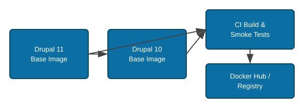

# drupal-docker-wrapper

[](
    https://github.com/scbd/drupal-docker-wrapper/actions/workflows/ci.yml
)

Dockerized Drupal 11 base image with common tools and
modules preinstalled to speed up local development and CI/CD.



## What this image provides

- Drupal 11 image (root `Dockerfile`).
- Pinned contrib modules & Drush installed in a dedicated build stage (auditable versions).
- Generated `modules-versions.txt` manifest (direct dependencies) for quick inspection.
- Composer patching enabled (see `Dockerfile` for applied patches) – deterministic (lockfile retained).
- Preinstalled CLI tools: curl, gosu, patch, git.
- Healthcheck stub (override as needed).
- **After-start background script** for deferred heavy operations (cleanup, permission hardening).

## Entrypoint & After-Start Architecture

The container uses a two-phase startup approach:

### Phase 1: Entrypoint (immediate)

The `entrypoint.sh` script runs immediately at container start:

1. **Applies patches** from `/opt/drupal/patches/` via `apply_patches_if_present`. Each `*.patch` (excluding
   `patches/old/`) is applied to the base directory it targets — the Drupal root for core/docroot-relative patches, or
   the matching module/theme under `web/modules/{contrib,custom}` / `web/themes/{contrib,custom}` for module-relative
   (composer-patches-style) patches. This runs synchronously before Apache starts so the bind-mounted
   `web/modules/custom` tree — which the image's build-time composer-patches pass never sees — is still patched.
   `web/modules/contrib` comes from the image and is not mounted over
   ([adr/0005](docs/adr/0005-remove-runtime-module-repair.md)). Idempotent: a patch already present is detected with
   `git apply --reverse --check` and skipped. `git apply` is the only applier and there are no marker files.
2. Forks the after-start script to run once the web server starts answering requests.
3. Starts Apache immediately (healthcheck unaffected), chaining to the upstream Drupal entrypoint.

### Phase 2: After-Start (once the web server answers)

The `entrypoint.sh` fork polls the local web server (`DRUPAL_AFTER_START_READY_URL`, default `http://127.0.0.1/`)
until it answers with any HTTP status, or the timeout elapses, then runs `after-start.sh`:

1. **Cleans up deprecated paths** (e.g. a scaffolded `web/robots.txt`). This is defense in depth: the build already
   excludes `robots.txt` from drupal-scaffold and deletes the upstream image's copy, so this step is normally a no-op.
   Runs on every start.
2. **Hardens image-resident code permissions** (`harden_image_code`, in the foreground of the
   already-forked after-start run, every start): `web/core`,
   `web/modules/contrib`, `web/themes`, `web/profiles`, `web/libraries`, `vendor` become `root:www-data` 755/644
   (the execute bit is then restored on `vendor/bin` entries and their targets), and root-level `web/` files
   (e.g. `index.php`, `web/.htaccess`) get the same 644 `root:www-data` treatment. These paths ship inside the
   image, which the build leaves `www-data`-owned, so this step is cheap to repeat and runs unconditionally.
   Failures are counted and named rather than swallowed, and never stop the container serving.

After-start never touches a bind mount. `php/custom.ini`, `web/modules/custom`, `web/sites`, `drush` and `temp` are
deliberately absent from the hardened list, so nothing in the container tightens `settings*.php` or `services*.yml`
any more — those permissions are entirely the responsibility of the deploy that defines the mount, or of the external
per-site script that already owns `.htaccess` under `sites/*/files`. A mount that ships `settings.php`
world-readable will stay world-readable. Because no pass walks network storage, there is no completion marker and no
gating: see [adr/0009](docs/adr/0009-confine-after-start-to-image-code.md).

There is no blanket `.htaccess` pass in after-start any more. It used to walk every directory under the project
root, including the EFS-backed `sites/*/files` upload trees, on every start, and it changed nothing: the code-path
`.htaccess` files were already covered by their own `-type f` chmod above, `web/.htaccess` was already covered by
the root-level pass above, and the one file it uniquely touched, `sites/*/files/.htaccess`, lives on a bind mount
the container no longer writes to at all. See
[adr/0008](docs/adr/0008-remove-htaccess-hardening-from-after-start.md). Per-site `.htaccess` hardening, where
wanted, is now an operator-owned script outside this repo.

There is no cache rebuild step in after-start. It was removed because it never worked on multisite: it ran
`drush cache:rebuild` with no site URI, which only bootstraps the default site, and it was gated on
`web/sites/default/settings.php` existing, which a multisite install may not have at all. See
[adr/0007](docs/adr/0007-remove-broken-multisite-cache-rebuild-from-after-start.md). A cache rebuild is still
required after an image change that ships new module code, but it is now an operator/deploy responsibility, run
per site through the mounted drush aliases (`@lk`, `@be`, …; see [Volume mounts](#volume-mounts)), for example
`gosu www-data vendor/bin/drush @lk cache:rebuild` for each site.

### Environment Variables

| Variable | Default | Description |
| ---------- | --------- | ------------- |
| `DRUPAL_AFTER_START_READY_TIMEOUT` | `120` | Seconds to wait for the web server to answer before running after-start anyway. |
| `DRUPAL_AFTER_START_READY_INTERVAL` | `2` | Seconds between readiness probes. |
| `DRUPAL_AFTER_START_READY_URL` | `http://127.0.0.1/` | URL the readiness probe polls. |

Example usage:

```sh
# Shorten the readiness wait for a quick smoke-test container
docker run -d --name drupal -p 8080:80 \
  -e DRUPAL_AFTER_START_READY_TIMEOUT=10 \
  -v drupal-sites:/opt/drupal/web/sites \
  scbd/drupal-docker-wrapper:VERSION_TAG
```

### Script Structure

```text
scripts/
├── entrypoint.sh      # Main entrypoint (thin - patches + fork after-start)
├── after-start.sh     # Background script (cleanup, permission hardening)
└── lib/
    ├── common.sh      # Shared utilities (log, find_project_root)
    └── patches.sh     # Patch application logic
```

## Layered build strategy (base + modules)

The root `Dockerfile` has three stages:

1. **base-core**: Drupal core (11.x.x/PHP 8.4) + minimal system packages + composer configuration (no contrib modules).
2. **with-modules**: Installs `cweagans/composer-patches` first, then all modules in a single consolidated
   `composer require` for cache efficiency; writes `modules-versions.txt`.
3. **final**: Adds labels, healthcheck, entrypoint wrapper, Apache docroot symlink, and permissions.

This preserves module version visibility in the Dockerfile while producing a reproducible, immutable image.

### Build context exclusions

A `.dockerignore` file excludes sensitive and unnecessary files from the build context:

- Environment files (`.env`, `.env*`)
- Archived patches (`patches/old/`)
- Git, CI/CD, documentation, and IDE files

## Volume mounts

> **Path note:** the `final` stage of the `Dockerfile` symlinks `/var/www/html` → `/opt/drupal/web` (the real docroot).
> So `/var/www/html/modules` *is* `/opt/drupal/web/modules`, `/var/www/html/sites` *is* `/opt/drupal/web/sites`, and so
> on. Mounts written against either path hit the same files.

### The mount contract (dmsm Swarm multi-site stacks)

The deployed `drupal` service (defined by the `dmsm` Swarm stack templates) bind-mounts exactly five host/EFS paths
per site:

```yaml
volumes:
  - '…/{env}/{env}/{multiSiteCode}/php/custom.ini:/usr/local/etc/php/conf.d/custom.ini'
  - '…/{env}/{env}/{multiSiteCode}/modules/custom:/var/www/html/modules/custom'
  - '…/{env}/{env}/{multiSiteCode}/sites:/var/www/html/sites'
  - '…/{env}/{env}/{multiSiteCode}/drush:/var/www/html/drush'
  - '…/{env}/{env}/{multiSiteCode}/temp:/opt/drupal/temp'
```

| Host path (per `{env}/{env}/{multiSiteCode}`) | Container path | Purpose | Verdict |
| --- | --- | --- | --- |
| `…/php/custom.ini` | `/usr/local/etc/php/conf.d/custom.ini` | PHP runtime overrides | ✅ config file — doesn't mask code |
| `…/modules/custom` | `/var/www/html/modules/custom` | custom modules only | ✅ overlays custom code, contrib untouched |
| `…/sites` | `/var/www/html/sites` | multisite config + uploaded files | ✅ mutable per-site data |
| `…/drush` | `/var/www/html/drush` | drush site aliases (`@lk`, `@be`, …) | ✅ config |
| `…/temp` | `/opt/drupal/temp` | script checkpoints, backups, error logs | ✅ mutable working data |

Only `modules/custom` is ever mounted — never the whole `modules` directory. `web/modules/contrib`, `web/core`, and
`vendor` always come from the image and cannot drift, because nothing else is bind-mounted over them. There is no
migration pending here: this is the deployed contract.

Only the **custom** modules genuinely need to come from the host — e.g. `bioland` (enabled via `drush en bioland`) and
the `scbd_*` modules, which live in their own repos and are not part of the image. Contrib ships in the image, so a
sync script such as `copy-modules-env-to-env` only ever needs to move `modules/custom` between environments.

The other four mounts (`custom.ini`, `sites`, `drush`, `temp`) carry config or mutable data, not image-built code.
**Never mount `vendor/`, `web/core/`, or `modules/contrib/` over the image.**

## Versioning

The image version (in `package.json` and the release git tag) tracks the **Drupal core version** it ships:

- A core bump is released as the **bare core version** — e.g. `11.x.x` — *even when contrib modules are updated
  alongside it*, since those module updates ship as part of that core release.
- A `-vN` suffix is appended **only** for a *subsequent* wrapper iteration on the **same** Drupal core version: a
  contrib module bump, a script change, or a `package.json` / dependency update made **without** moving core. Increment
  `N` for each such iteration.

| Tag | Meaning |
| ----- | --------- |
| `11.x.x` | Drupal core 11.x.x (initial wrapper build for this core; module updates included) |
| `11.x.x-v1` | First wrapper change on top of 11.x.x (module/script/package update, core unchanged) |
| `11.x.x-v2` | Second such change, still on core 11.x.x |

Keep `package.json` and `package-lock.json` in sync with this version. The GitHub Actions release job
derives the published Docker tag from the GitHub Release tag (`github.event.release.tag_name`), so tag
releases match — e.g. publish a release with tag `11.x.x`.

## Local development on Apple Silicon (Mac, ARM64)

This image is **`linux/amd64`-only** — it does **not** build natively for `arm64`. The `Dockerfile`
installs AWS CLI v2 from the hardcoded x86_64 archive (`awscli-exe-linux-x86_64.zip`), and production
runs on amd64, so a native `arm64` build would ship a wrong-architecture `aws` binary that fails at
runtime. On an Apple Silicon Mac you build and run the amd64 image under emulation.

**One-time setup (Docker Desktop):**

1. Enable Rosetta for much faster x86_64 emulation: **Settings → General → "Use Rosetta for
   x86_64/amd64 emulation on Apple Silicon"** (requires macOS 13+ and the VirtioFS file sharing
   implementation). Without Rosetta, Docker falls back to QEMU, which builds and runs noticeably slower
   but still works.
2. (Optional) Make `linux/amd64` the default for every Docker command so you never forget the flag —
   this is also what makes `./ci/test-ci-locally.sh` (whose `docker build` omits `--platform`) build the
   correct architecture on Apple Silicon:

   ```sh
   export DOCKER_DEFAULT_PLATFORM=linux/amd64
   ```

   Add it to your `~/.zshrc` to persist it across shells.

**Then build and run as below** — every `docker build`/`docker run` for this image must target
`--platform linux/amd64` on Apple Silicon (already included in the commands that follow). You will see a
`requested image's platform (linux/amd64) does not match the detected host platform` warning at `run`
time; that is expected and harmless under emulation.

> The amd64-built image runs fine for local Drupal development (Apache, PHP, Drush, contrib modules).
> Emulation only costs build/startup speed, not correctness.

## Quick start (Drupal 11 image)

Replace `VERSION_TAG` (e.g. `11.x.x`, or `11.x.x-v1` for a wrapper iteration — see [Versioning](#versioning)).
On Apple Silicon, see [Local development on Apple Silicon](#local-development-on-apple-silicon-mac-arm64) first.

```sh
# Build
docker build --platform linux/amd64 -t scbd/drupal-docker-wrapper:VERSION_TAG .

# Run (ephemeral code, persistent files — single-container smoke test)
# In production this image runs under the dmsm Swarm multi-site stack with bind mounts;
# see "Volume mounts" above.
# --platform is required on Apple Silicon (omit it on amd64 hosts, or set DOCKER_DEFAULT_PLATFORM).
docker run -d --platform linux/amd64 --name drupal -p 8080:80 \
  -v drupal-sites:/opt/drupal/web/sites \
  scbd/drupal-docker-wrapper:VERSION_TAG

# Inspect installed (direct) dependency versions
docker exec drupal head -50 /opt/drupal/modules-versions.txt
```

### Drush site install example

Local smoke tests only — never point this at a shared environment, and never leave the placeholder
admin password in place.

```sh
docker exec -it drupal bash -lc "vendor/bin/drush si -y standard \
  --db-url='mysql://DB_USER:DB_PASS@DB_HOST:3306/DB_NAME' \
  --site-name='My Site' \
  --account-name=admin \
  --account-pass='CHANGE_ME'"
```

## Upgrading a module version

1. Edit the version in the `composer require` line inside the `with-modules` stage of the `Dockerfile`.
2. Rebuild & tag the image.
3. Deploy the new image (ensure code is not volume-mounted).
4. Rebuild the cache for every site, through its mounted drush alias, for example
   `gosu www-data vendor/bin/drush @lk cache:rebuild`. Nothing in the image does this automatically; see
   [adr/0007](docs/adr/0007-remove-broken-multisite-cache-rebuild-from-after-start.md).

## Security & hardening notes

- **Base image**: Track `drupal:11.x-php8.4` upstream updates; rebuild regularly.
- **Build context**: `.dockerignore` excludes `.env*`, `patches/old/`, git/CI files from the image.
- **Permissions**: Image-resident code is `root:www-data`, directories 755, files 644. Everything under the five
  bind mounts — including `settings*.php`/`services*.yml` under `web/sites` — is the deploy's responsibility; the
  container does not tighten it. See [adr/0009](docs/adr/0009-confine-after-start-to-image-code.md).
- **Privilege separation**: Permission hardening needs root to `chown`; drush can be run as www-data via `gosu` by
  hand for operator tasks such as a per-site cache rebuild.
- **Healthcheck**: Simple HTTP probe; customize to a lightweight status endpoint for production.
- **Lockfile**: We retain `composer.lock` (do NOT delete) ensuring deterministic dependency resolution.
- **Patch provenance**: Patches declared inline in `Dockerfile`; archived in `patches/old/` when no longer needed.
- **Supply chain**: Explicit versions prevent implicit upgrades; periodically review `composer outdated --direct` in a
  CI job for update visibility.

## CI/CD (GitHub Actions)

The pipeline in [`.github/workflows/ci.yml`](.github/workflows/ci.yml) builds, lints, and smoke-tests the Drupal 11 image.

### Testing Locally

Before pushing changes, test the full CI pipeline locally:

```sh
./ci/test-ci-locally.sh
```

This simulates the GitHub Actions workflow without pushing to Docker Hub.

### Production Deployment

Configure Docker Hub credentials to enable automated pushes on tagged releases:

Repository secrets (Settings → Secrets and variables → Actions):

- `DOCKERHUB_USERNAME`
- `DOCKERHUB_TOKEN`

Uncomment the `push-images` job in [`.github/workflows/ci.yml`](.github/workflows/ci.yml) to enable
release-based publishing. It runs when a GitHub Release is published with a Drupal 11 tag (e.g. `11.x.x`).

Add an automated scheduled rebuild (weekly) to pick up upstream security patches.

## Troubleshooting

| Symptom | Cause | Fix |
| --------- | ------- | ----- |
| Custom module changes not appearing | `modules/custom` mount stale on host/EFS | Verify the host `modules/custom` directory is synced — see [Volume mounts](#volume-mounts) |
| Composer patch not applied | Patch URL changed or network issue | Mirror patch; verify URL; rebuild |
| High CVE count in scan | Outdated base image packages | Rebuild with newer base tag; maybe dist-upgrade |
| Drush missing | Stage caching issue | Clear build cache (`--no-cache`) and rebuild |
| After-start not running | Check logs for errors | `docker logs <container>` - look for `[after-start]` messages |
| Stale service container/routes after a module bump | No cache rebuild ran after deploy | Rebuild the cache per site via its drush alias, e.g. `drush @lk cache:rebuild` |

Note: If you override the container USER or execute composer in a derived image, make sure to:

```sh
mkdir -p /var/www/.composer/cache
chown -R www-data:www-data /var/www/.composer
```

### Build and push in one step (local)

```sh
# for dev and stg
docker build --platform linux/amd64,linux/arm64 -t scbd/drupal-docker-wrapper:${env}-${VERSION_TAG} . --push

#prod
docker build --platform linux/amd64,linux/arm64 \
  -t scbd/drupal-docker-wrapper:${VERSION_TAG} \
  -t scbd/drupal-docker-wrapper:latest . --push
```

### Push to a host over SSH, without a registry

```sh
sudo docker save scbd/drupal-docker-wrapper:stg-11.4.5-v2 | gzip \
  | ssh <user>@<staging-host> "gunzip | sudo docker load"
```

## License

This project: MIT (container build scripts). Drupal & contributed modules: GPL-2.0-or-later.
The `Dockerfile` is authoritative for module version declarations.
