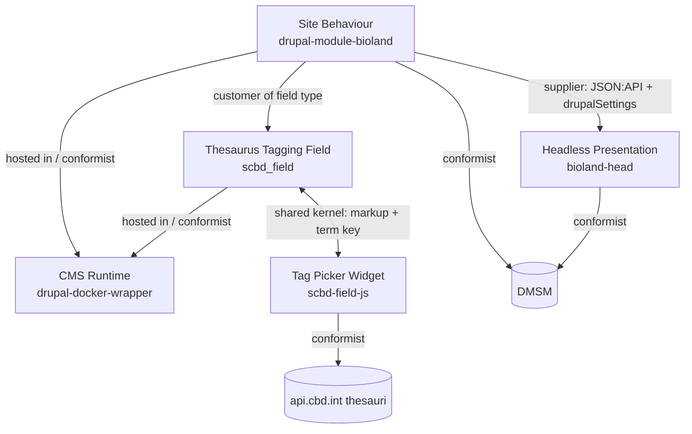

# Bioland: Context Map

The bounded-context index for the Bioland architectural plan. Each of the five repositories is a
single bounded context with its own ubiquitous language. This file maps the contexts to their
spokes, names the relationships between them, and lists the terms that are *shared* or *translated*
across a boundary - the places where one context's language meets another's.

Per-context glossaries: this repo's [CONTEXT.md](CONTEXT.md) is the **CMS Runtime** glossary. Each
sibling repo keeps its own `docs/CONTEXT.md` for its context (referenced as prose below, not linked,
since the code lives in another repo).

## Contexts

| Context | Spoke | Repo (`Code:`) | Ubiquitous language (sample) |
| ------- | ----- | -------------- | ---------------------------- |
| **CMS Runtime** | [drupal-docker-wrapper](drupal-docker-wrapper.md) | `drupal-docker-wrapper` (this repo) | wrapper image, upstream image, build stage, contrib / custom module, pinned version, two-phase startup, after-start, image-code hardening, mount contract |
| **Site Behaviour** | drupal-module-bioland | `Code: drupal-module-bioland` (branch `latest`) | content, tags, additional fields, field visibility, home widgets, mega menu, country-map defaults, `is_biosafety_land` |
| **Thesaurus Tagging Field** | drupal-module-scbd-thesaurus-tags | `Code: drupal-module-scbd-thesaurus-tags` (machine name `scbd_field`) | `scbd_field_thesaurus` field type, thesaurus widget, domain, **term key**, `value` / `value2`, mount markup |
| **Tag Picker Widget** | drupal-module-scbd-field-js | `Code: drupal-module-scbd-field-js` | tag picker, mount, hidden input, **domain**, **term key**, `singleValueDomains`, auto-add |
| **Headless Presentation** | bioland-head | `Code: bioland-head` (branch `bsl-2026-04`) | tenant, `siteCode`, `isBchSite`, page, menus, locale, edit mode, comment |

External contexts the system integrates with but does not own: **DMSM** (per-tenant config, locale,
geography), **api.cbd.int** (SCBD thesauri + CBD index), and the public data partners (GBIF, GeoBON,
Panorama, UN SDG).

## The map

## Relationships

| Upstream (supplier) | Downstream (consumer) | Pattern | Seam / translation |
| ------------------- | --------------------- | ------- | ------------------ |
| CMS Runtime | Site Behaviour, Thesaurus Field | **Host / Conformist** | The custom modules run inside the runtime and accept its Drupal + mount contract as-is; they are overlaid under `modules/custom` per the runtime's mount rules. |
| Thesaurus Field | Site Behaviour | **Customer / Supplier** | Site Behaviour detects `scbd_field_thesaurus` fields to mount "additional fields"; it depends on the field type's existence and shape. |
| Thesaurus Field | Tag Picker Widget | **Shared Kernel / Partnership** | The DOM markup + hidden-input contract and the **term key** vocabulary are shared; the two must change together. This is the tightest coupling in the system and has no end-to-end test crossing it (hub deferred register). |
| Site Behaviour | Headless Presentation | **Customer / Supplier (Published Language)** | The published language is the **JSON:API resources + `drupalSettings.bioland` config**. The head conforms to whatever Drupal exposes; it never writes content state, only comments. |
| DMSM (external) | Site Behaviour, Headless | **Conformist** | Both read `config/{env}/{multiSiteCode}/{siteCode}` and accept DMSM's shape; neither wraps it in an anti-corruption layer today. |
| api.cbd.int (external) | Tag Picker Widget | **Conformist** | The widget consumes the thesaurus REST + Solr term shapes directly. |

## Shared and translated terms (where languages meet)

- **Term key** - the stable slug a tag persists as (e.g. `GBF-TARGET-03`; national targets are UUIDs).
  *Shared kernel* across the Thesaurus Field (stores it), the Tag Picker (reads / writes it), and the
  head (receives it as an opaque comma-separated string - core `string` formatter, never resolved to a
  label server-side). A change to the key format ripples through all three.
- **Domain** - a named category drawn from one controlled vocabulary, rendered as one dropdown.
  *Shared* between the Thesaurus Field (whitelists which domains a field offers) and the Tag Picker
  (renders each domain, and decides single- vs multi-select via its own `singleValueDomains` default).
- **`is_biosafety_land` / `isBchSite`** - the same per-tenant mode under two names. *Translated* across
  the Site Behaviour context (Drupal, derived from DMSM's `multiSiteCode === 'bsl'`) and the Headless
  context (Nuxt, derived from the host). Both switch branding, active `tags` terms, and exposed menus.
- **`siteCode` / `multiSiteCode` / `env`** - the DMSM config key. *Translated* by both Site Behaviour
  (`parseHostname()`) and the head (`extractSiteCodeFromHost`) from the request host into the same DMSM
  lookup tuple - independently, which is itself a small duplication worth noting.
- **content / `node--content`** - the editorial content type. Named `content` in Drupal; surfaced as
  the `node--content` JSON:API resource the head reads.

## Promotion / maintenance

This map exists because Bioland genuinely crosses bounded contexts (five repos, distinct languages,
real translation seams). Keep it in step with the spokes: when a seam changes, update the relationship
row and the shared-terms list here, and the affected spoke's *Owned interface* section. A new shared
or colliding term across contexts is the trigger to add a row above (per the `docs-context-map` skill).
