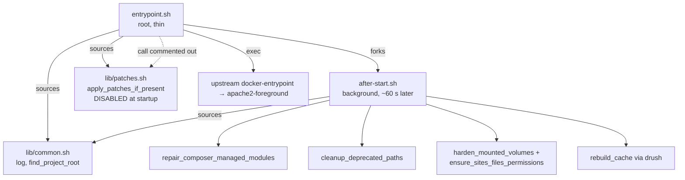
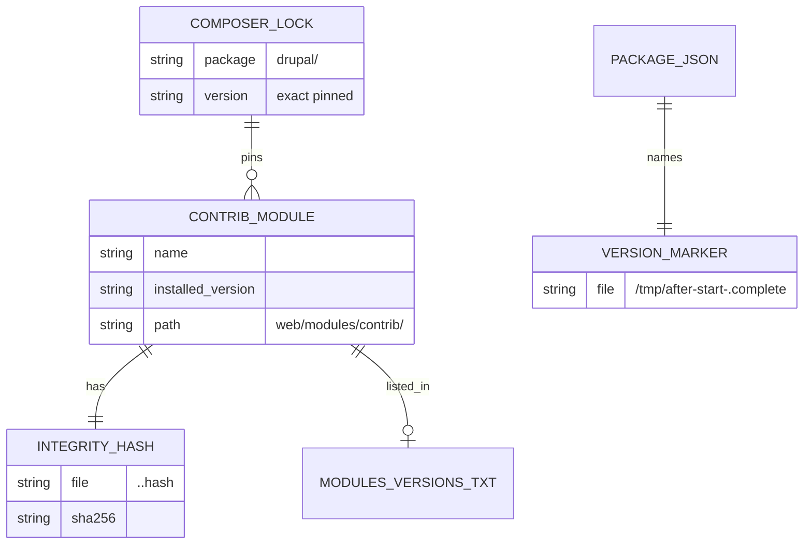
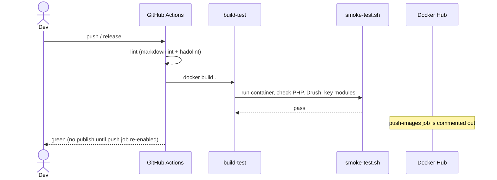
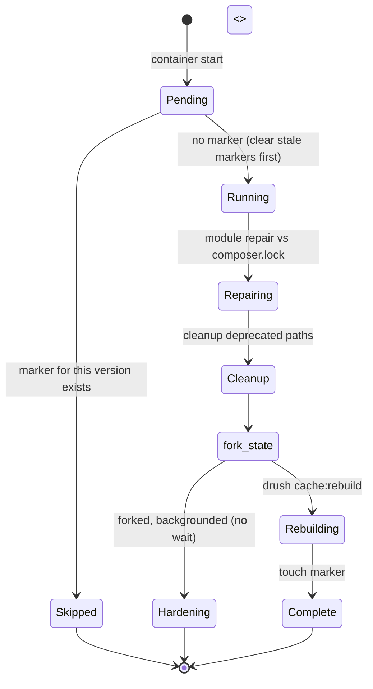

> **Plan vs. as-built.** This is the design-of-record for the **Drupal Docker Wrapper** project.
> [architecture.md](architecture.md) is the as-built snapshot; when they conflict, `architecture.md`
> is the truth about the code and this plan is the truth about intent. The overlap between the two is
> deliberate provenance, not duplication.
>
> Part of the [Bioland](bioland.md) architectural plan. The cross-project hub (System Overview,
> Actors, Workflow Statuses, End-to-End Flows, Verification, Deferred Items) is the
> [hub](bioland.md); glossary: [CONTEXT.md](CONTEXT.md); context map:
> [CONTEXT-MAP.md](CONTEXT-MAP.md). This doc owns the **Drupal Docker Wrapper** (Docker / Bash /
> Composer) work. Sibling spokes: [Bioland Head](bioland/bioland-head.md),
> [Drupal Module Bioland](bioland/drupal-module-bioland.md),
> [Drupal Module SCBD Thesaurus Tags](bioland/drupal-module-scbd-thesaurus-tags.md),
> [Drupal Module SCBD Field JS](bioland/drupal-module-scbd-field-js.md).

# Bioland: Drupal Docker Wrapper — Architectural Plan

## Context

The Drupal Docker Wrapper is the CMS runtime of the Bioland system. It is a single, reusable Docker
image (`scbd/drupal-docker-wrapper`) built on the official `drupal:11.x-php8.4` upstream image,
layering every required contrib module and Drush at pinned exact versions, along with CLI tooling
and a two-phase startup script. Every other Drupal-side Bioland project — `drupal-module-bioland`,
`scbd_field`, and the module dependencies they require — runs inside a container started from this
image.

This project is the hub repo for the Bioland architectural plan. Its design documents (this file,
[architecture.md](architecture.md), [prd.md](prd.md), [CONTEXT.md](CONTEXT.md)) are the
system-of-record for the CMS Runtime bounded context. The cross-project material lives in the
[Bioland hub](bioland.md).

> Cross-project decisions: [docs/adr/](adr/).

---

## Owned Interface (the seam)

The wrapper is a deep module. Almost all of its implementation — the multi-stage build, the ~40
pinned contrib modules, the integrity hashes, the two-phase startup, the permission hardening — is
hidden from consumers. What other projects actually depend on is a small, stable contract:

**1. The runtime port — a Drupal 11 site that boots immediately.**
The image starts Apache on `:80` in seconds and passes its `HEALTHCHECK` before the background
provisioning finishes. The custom-module spokes (`bioland`, `scbd_field`) depend on a live,
pinned Drupal core + Drush environment to run inside, not on knowing how it was assembled.

**2. The mount contract — the load-bearing seam.**
Exactly five paths are safe to bind-mount from EFS:

| Mount path | Purpose |
|---|---|
| `modules/custom` | Custom module overlays (`bioland`, `scbd_*`) |
| `sites` | Multi-site config and per-site `files/` |
| `drush` | Site aliases |
| `temp` | Checkpoints, backups, scratch |
| `php/custom.ini` | PHP runtime overrides |

Mounting `vendor/`, `web/core/`, or the whole `modules/` directory is a volume mask — it hides the
image's pinned contrib tree and defeats the reproducibility guarantee. This is the contract the dmsm
Swarm deployment must honour for the pin to hold.

**3. The custom-module overlay contract.**
`drupal-module-bioland` and `scbd_field` are not baked into the image. They are overlaid under
`modules/custom` at runtime. The wrapper guarantees they land in a Drupal that already has their
contrib dependencies (`linkit`, `fontawesome`, `jsonapi_extras`, `auto_node_translate`, etc.)
pinned and present.

**4. The after-start guarantees.**
Once per container start per image version, the wrapper: (a) repairs any contrib drift against
`composer.lock`, (b) cleans deprecated paths, (c) hardens permissions (code read-only
`root:www-data`; only `sites/*/files` writable), and (d) rebuilds the Drupal cache. Custom modules
can assume this baseline; they do not run it themselves.

What is **not** in the interface: the build stages, the integrity hashes (build-time artifacts,
not machine-verified at startup), the dormant startup patch mechanism, and the module repair
internals. Those are implementation, hidden behind the surface above.

---

## Architecture Views

*Deep view: [architecture.md](architecture.md) — the as-built snapshot.
Sections are linked per-item below.*

### System Context (C4 L1)

*See [architecture.md §2 System Context](architecture.md#2-system-context-c4-l1) for the full
Mermaid C4Context diagram.*

The wrapper sits between the upstream `drupal:11.x-php8.4` image and the Packagist/drupal.org
sources it builds FROM, and the consumers that depend on it at runtime: the dmsm Swarm stacks, the
custom module overlays (from EFS), and the bioland-head Nuxt frontend that reads the Drupal
JSON:API. Developers and GitHub Actions build and test the image; Docker Hub holds published tags.

### Containers (C4 L2) — what is built in vs. overlaid at runtime

*See [architecture.md §3 Containers](architecture.md#3-containers-c4-l2) for the full flowchart.*

The image contains four kinds of content:

| Content | Where | Notes |
|---|---|---|
| Drupal 11 core + PHP 8.4 | `web/core/`, `vendor/` | From the upstream image |
| Pinned contrib modules (~40) | `web/modules/contrib/` | Built in the `with-modules` stage |
| Drush 13 + CLI tooling | system path / composer global | curl, gosu, jq, patch, git, mysql client, aws cli |
| Startup scripts + manifest | `scripts/`, `/opt/drupal/modules-versions.txt` | `entrypoint.sh`, `after-start.sh`, integrity hashes |

Five paths are **overlaid at runtime** via bind mounts from EFS (see Owned Interface §2 above). The
hard rule: never mount over `vendor/`, `web/core/`, or `web/modules/contrib/`.

### Key Components (C4 L3)

*See [architecture.md §4 Key Components](architecture.md#4-key-components-c4-l3) for the
full component flowcharts.*

#### Build stages

The `Dockerfile` is three named stages, each adding one concern:

| Stage | Adds | Cache strategy |
|---|---|---|
| `base-core` | Upstream Drupal core, system packages (curl, gosu, jq, nano, mysql-client, rsync, unzip, AWS CLI v2, GD/AVIF rebuild), composer config | Cache invalidates only on system-package or base-image changes |
| `with-modules` | One consolidated `composer require` of all ~40 pinned modules + Drush; `modules-versions.txt`; per-module integrity hashes | Cache invalidates on any module version bump; isolated from core |
| `final` | Production PHP ini (`zz-production.ini`), OCI labels, docroot symlink, startup scripts, composer-home writable for www-data, `HEALTHCHECK`, `ENTRYPOINT` | Small, invalidates rarely |

Two deliberate ordering constraints:

- The `cweagans/composer-patches` plugin must be required **before** any patched package, so it is
  a separate `composer require` step at the top of `with-modules`.
- Three guzzle/psr7 security advisories (`PKSA-93qv-9n9h-6k6p`, `PKSA-k22t-f949-t9g6`,
  `PKSA-7qs6-zvnz-h66r`) are temporarily suppressed in `base-core` for BL-695 so the Critical
  Drupal 11.3.12 core fix can build before patched releases land in core's dependency ranges.
  Remove when Drupal issue #3599842 is resolved.

#### Startup scripts



`lib/patches.sh` is fully implemented (multi-strategy `patch`, applied markers) but its entry point
`apply_patches_if_present` is commented out in `entrypoint.sh`. Startup patch application is
dormant; build-time composer patching via `cweagans/composer-patches` is active.

---

## Data Model

There is no application database in this repo. The "data" is the dependency manifest produced at
build time and checked at runtime:



`composer.lock` is the authoritative source of truth at runtime: module repair compares each
installed module's version against it and restores any drift via `composer install`. The integrity
hashes are build-time artifacts only — no runtime script reads them today. `modules-versions.txt`
is the human-readable manifest of direct dependency versions.

---

## Key Flows

*See [architecture.md §5 Key Flows](architecture.md#5-key-flows-sequence-diagrams) for the full
sequence diagrams. Summaries follow.*

### Container startup — two-phase

```mermaid
sequenceDiagram
  participant Docker
  participant Entry as entrypoint.sh (root)
  participant Apache as Apache / upstream entrypoint
  participant After as after-start.sh (background)
  participant Composer
  participant Drush

  Docker->>Entry: ENTRYPOINT [apache2-foreground]
  Note over Entry: apply_patches_if_present is commented out
  Entry->>After: fork (sleep 60; run after-start) &
  Entry->>Apache: exec docker-entrypoint apache2-foreground
  Apache-->>Docker: serving on :80 — HEALTHCHECK passes

  Note over After: ~60 s later, in background
  After->>After: marker /tmp/after-start-<version>.complete present?
  alt marker exists
    After-->>After: exit 0 (already done this version)
  else first run for this version
    After->>After: clear stale version markers
    After->>Composer: module repair vs composer.lock (as www-data)
    After->>After: cleanup_deprecated_paths (robots.txt)
    par background hardening
      After->>After: harden_mounted_volumes + sites/*/files perms
    end
    After->>Drush: cache:rebuild (as www-data via gosu)
    After->>After: touch marker
  end
```

The fork design means the healthcheck never waits on Composer. Apache is up in seconds;
the expensive, privilege-sensitive work runs once afterward, gated by the version marker so a
container restart on the same image skips it.

### CI build and release



---

## Connectors / Rules

**Upstream / supply chain.**
Builds `FROM drupal:11.x-php8.4`. Every contrib module and Drush is pinned to an exact version
declared inline in the `with-modules` `composer require`. `composer.lock` is retained in the image.
Build-time patching via `cweagans/composer-patches` is live; three guzzle/psr7 advisories are
temporarily suppressed for BL-695 (remove per Drupal #3599842).

**Module repair adapter.**
`after-start.sh` → `repair_composer_managed_modules`: walks every contrib module directory,
compares the installed version against `composer.lock`, removes any stale or mis-owned directory,
and runs `composer install` (as `www-data`) to restore the pins. With the recommended
`modules/custom`-only mount this is a near no-op for contrib; with the current whole-`modules`
mount it does real work each start.

**Permission hardening adapter.**
`after-start.sh` → `harden_mounted_volumes` + `ensure_sites_files_permissions`: makes the code
tree read-only (`root:www-data`, dirs 755 / files 644), locks `temp/` to `root:root` 700, forces
every `.htaccess` to 644, and leaves only `sites/*/files` writable (`www-data:www-data` 775). Root
is used only for this hardening step and for binding port 80; all composer and Drush work runs as
`www-data` via `gosu`.

**CI / release adapter.**
GitHub Actions: `lint` (markdownlint + hadolint) gates `build-test` (docker build + smoke-test). The
`push-images` job reads the GitHub Release tag (`github.event.release.tag_name`) for the image tag and is
currently commented out — releases build and test but do not push to Docker Hub until it is re-enabled.

**Healthcheck.**
`HEALTHCHECK` makes an HTTP probe on `/` with a 40-second start period. The container reports
healthy as soon as Apache serves, independently of after-start progress. A healthy container does
not guarantee that after-start succeeded; check `[after-start]` log lines.

---

## Quality Attributes (NFRs)

*See [architecture.md §9 Quality Attributes](architecture.md#9-quality-attributes-nfrs) for the
full table. Summaries per attribute:*

| Attribute | Target | Design mechanism |
|---|---|---|
| **Reproducibility** | Same digest from same source | Every contrib module and Drush pinned inline in the `Dockerfile`; `composer.lock` retained |
| **Determinism** | No implicit upgrades | Single consolidated `composer require` with exact versions; lockfile kept; `composer outdated --direct` used for visibility |
| **Startup latency** | Apache serving in seconds | Thin entrypoint forks after-start and exec-chains the upstream entrypoint immediately |
| **Idempotent provisioning** | One-time work per container per version | After-start gated by `/tmp/after-start-<version>.complete`; stale markers cleared on new version |
| **Health observability** | Container healthy independently of provisioning | HTTP `HEALTHCHECK` on `/` with 40 s start period; never blocked by Composer or Drush |
| **Security / least privilege** | Web user cannot write code | root only for permission fixes and port bind; then `www-data` via gosu; code `root:www-data` read-only; only `sites/*/files` writable |
| **Supply-chain control** | Auditable, explicit deps | Versions visible in `Dockerfile`; `modules-versions.txt` manifest; per-module integrity hashes; `.dockerignore` excludes `.env*` and archived patches |
| **Build efficiency** | Fast incremental rebuilds | Multi-stage build; module installs isolated; apt and Composer caches mounted; build-only tools purged |

---

## Decisions

Recorded in [docs/adr/](adr/). Rationale lives there; not restated here.

| ADR | Decision |
|---|---|
| [0001](adr/0001-record-architecture-decisions.md) | Adopt Architecture Decision Records |
| [0002](adr/0002-pin-contrib-modules-in-a-dedicated-build-stage.md) | Pin contrib modules at exact versions in a dedicated build stage rather than floating constraints or a separate manifest |
| [0003](adr/0003-two-phase-startup-entrypoint-and-after-start.md) | Two-phase startup: thin entrypoint chains Apache immediately; after-start does heavy provisioning in the background |
| [0004](adr/0004-gate-after-start-with-a-per-version-marker.md) | Gate after-start one-time work with a version-stamped marker in `/tmp` so restarts skip it and upgrades re-run it |

---

## Workflow Transitions

The wrapper owns no part of the content, comment, or translation workflow — those are the
`drupal-module-bioland` spoke's domain. It owns one operational state machine: the after-start
provisioning run, gated by the version marker.



| State | Transition trigger | Notes |
|---|---|---|
| `Pending` | Container start | Always enters here |
| `Skipped` | Marker for this version already exists | Container restart on the same image; work skipped |
| `Running` | No marker found | Clears any stale `after-start-*.complete` markers first |
| `Repairing` | Entered from `Running` | `repair_composer_managed_modules` vs `composer.lock` as `www-data` |
| `Cleanup` | Repair done | `cleanup_deprecated_paths` (e.g. `robots.txt`) |
| `Hardening` | Forked at `Cleanup` exit, runs in background | Permission hardening; cache rebuild does not wait on it |
| `Rebuilding` | Forked at `Cleanup` exit, runs in foreground | `drush cache:rebuild` as `www-data` via `gosu` |
| `Complete` | Rebuild done | Marker file touched; subsequent restarts on the same version → `Skipped` |

This machine is self-contained: it touches no content state and is invisible over JSON:API. A
container restart on the same image short-circuits to `Skipped`; a new image version clears stale
markers and re-runs the full sequence.

---

## Deferred / Open Items

| Item | Owner | Notes |
|---|---|---|
| **Volume mask in production** | dmsm / ops | Deployed Swarm stacks still mount the whole `modules` directory, shadowing the image's pinned contrib until the `modules/custom`-only mount is adopted. Until fixed, module repair at startup is doing real work the mount strategy should make unnecessary. Resolution: migrate the Swarm compose files to mount only `modules/custom`. |
| **Module repair is a heavy runtime fallback** | this repo | With the whole-modules mount, startup can pull packages on a fresh container. Near no-op once the volume mask is fixed. |
| **Startup patch application is dormant** | this repo | `lib/patches.sh` is complete but the `apply_patches_if_present` call is commented out in `entrypoint.sh`. Re-enable deliberately if a runtime patch is needed. Build-time composer patching is the current active path. |
| **Temporary advisory ignores (BL-695)** | this repo | Three guzzle/psr7 advisories suppressed to allow the Critical Drupal 11.3.12 build. Must be removed once Drupal issue #3599842 is resolved. Left in place, they will hide real future advisories on those packages. |
| **Release publishing is off** | CI / ops | The GitHub Actions `push-images` job is commented out. Tagged releases build and test but do not push to Docker Hub. Re-enable with Docker Hub credentials when ready to publish. |
| **No scheduled weekly rebuild** | CI | README calls for a weekly rebuild to pick up upstream base-image security patches; the automation is not yet in place. |
| **No end-to-end test crossing the mount seam** | cross | No automated test verifies that the custom-module overlay + contrib pin produce a working Drupal site end-to-end. The smoke test checks PHP, Drush, and key module directories but not a live page render. |

---

## Verification Checklist

Checks scoped to this project. Items marked `[cross]` also appear in the Bioland hub's verification
checklist.

- [ ] Apache passes its `HEALTHCHECK` within the 40-second start period on a cold `docker run`.
- [ ] A fresh `docker run` of a published tag yields a contrib tree whose versions match
      `modules-versions.txt` and the inline `Dockerfile` pins — 0 drift.
- [ ] After-start runs its one-time work exactly once per container per image version: the marker is
      present after the first run; a restart logs "already complete" and exits early.
- [ ] A new image version causes after-start to re-run (old marker no longer matches).
- [ ] The web user (`www-data`) cannot write to `web/core/`, `web/modules/`, `vendor/`, or any
      `.htaccess` file after hardening completes.
- [ ] Only `sites/*/files` is writable by `www-data` after hardening.
- [ ] Build context contains no `.env*` or archived patch files (`.dockerignore` enforcement).
- [ ] CI fails the build when a key module directory (`jsonapi_extras`, `search_api`) is missing or
      PHP / Drush are broken (smoke test).
- [ ] `[cross]` Bind-mounting only `modules/custom` (not the whole `modules/` tree) produces a
      working site with no volume-masked contrib.
- [ ] `[cross]` Custom modules (`bioland`, `scbd_field`) overlaid at runtime find their contrib
      dependencies (`linkit`, `fontawesome`, `jsonapi_extras`, etc.) pinned and present.
