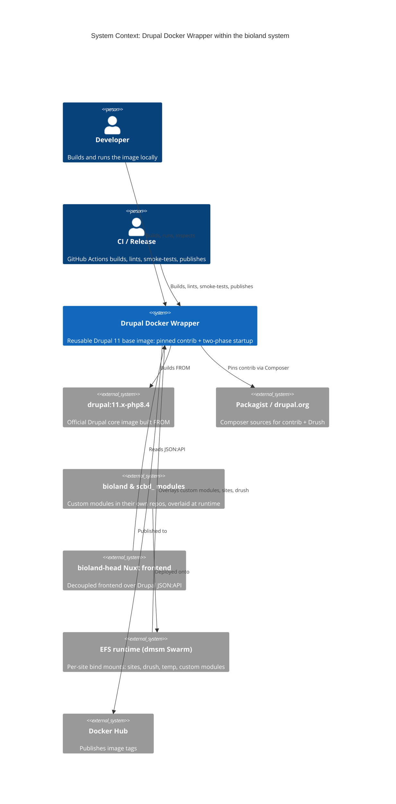
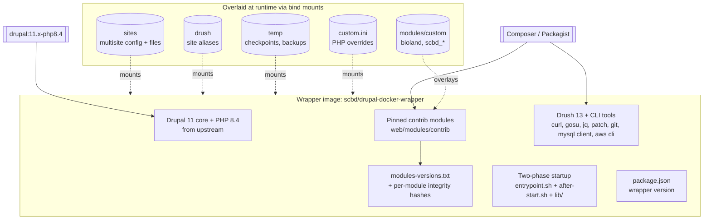
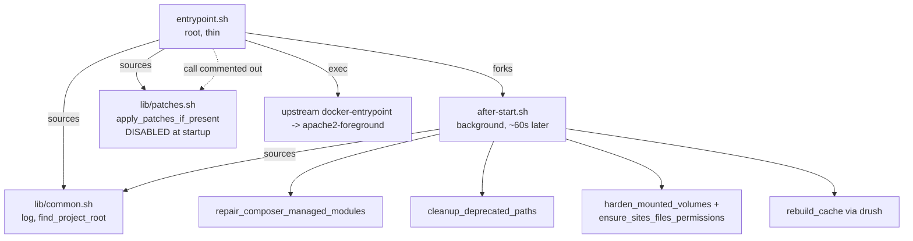
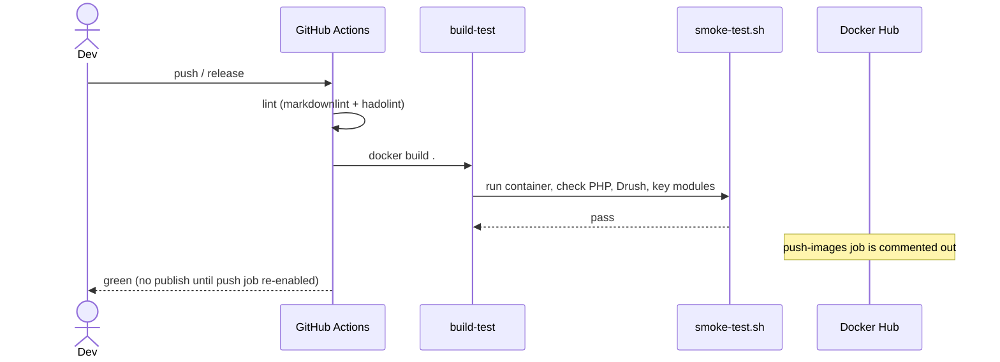
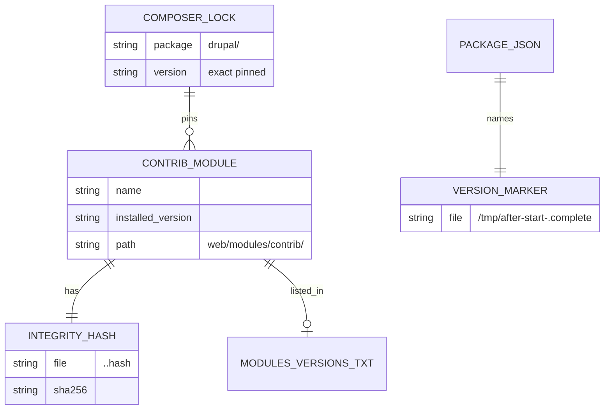
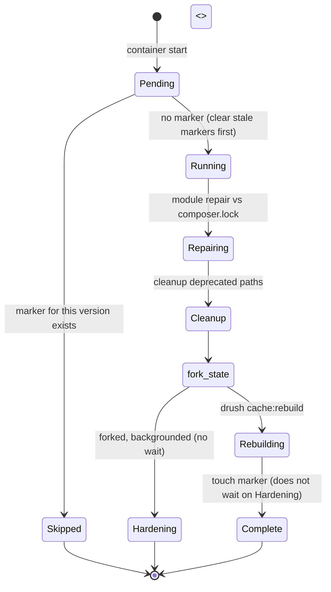
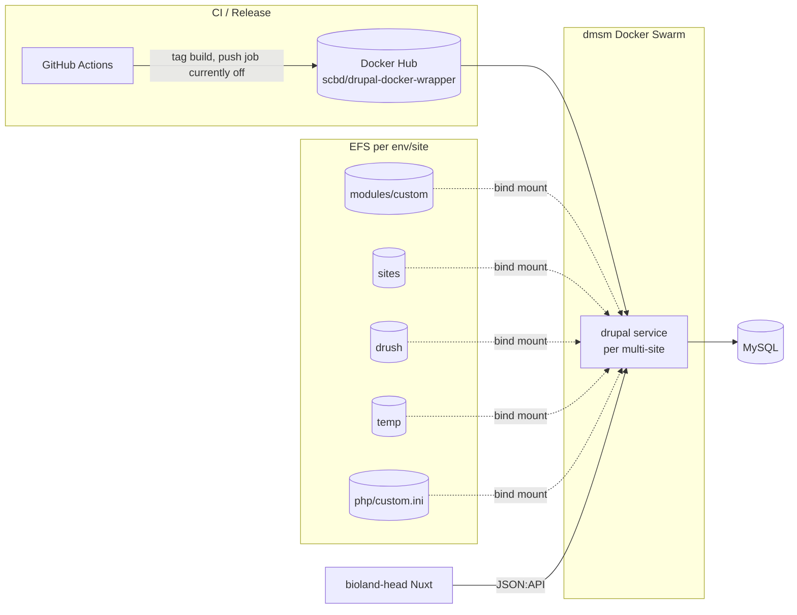

# Drupal Docker Wrapper Architecture

## 1. Overview

This repo builds one thing: a reusable Drupal 11 base Docker image (`scbd/drupal-docker-wrapper`)
that the wider bioland system runs as its CMS container. The image layers a fixed set of pinned
contrib modules, Drush, and CLI tooling on top of the official `drupal:11.x-php8.4` image, then adds
a two-phase startup that gets Apache serving immediately and defers the heavy provisioning to a
background script.

It is the build and runtime orchestration hub for the Drupal half of bioland. The custom modules
(`bioland`, the `scbd_*` family) live in their own repos and are overlaid at runtime; the
bioland-head Nuxt frontend consumes the Drupal JSON:API this image exposes. See `docs/prd.md` for
the product framing and `docs/CONTEXT.md` for the vocabulary used throughout.

The defining tension of the design is reproducibility versus the runtime reality that the deployed
stack bind-mounts a module directory from EFS. The build pins everything; the after-start phase
re-asserts that pinning when a mount has drifted. Both phases speak one language, so this is a
single bounded context.

## 2. System Context (C4 L1)



> Mermaid C4 is experimental. If a renderer lacks C4 support, read this as: the wrapper image sits
> between the upstream Drupal image / Composer sources it consumes, the CI and developers who build
> it, and the EFS-backed Swarm runtime plus the Nuxt frontend that depend on it at run time. The
> custom modules and bioland-head are named conceptually; their code lives in other bioland repos.

## 3. Containers (C4 L2)

The image is one deployable artifact, but it is useful to see what is built into it and what is
overlaid at runtime.



The hard rule visible here: only `modules/custom`, `sites`, `drush`, `temp`, and the PHP ini are
safe to mount. Mounting the whole `modules` directory is a volume mask (see `docs/CONTEXT.md`) and
defeats the pin. Never mount `vendor/`, `web/core/`, or `modules/contrib/`.

## 4. Key Components (C4 L3)

### 4.1 Build stages

The `Dockerfile` is three stages, each adding one concern. Keeping module installs in their own
stage means a module bump invalidates only that layer's cache, not core.

```mermaid
flowchart LR
  subgraph base [base-core]
    b1[FROM drupal:11.4.1-php8.4]
    b2[System packages:<br/>curl, gosu, jq, nano,<br/>mysql client, rsync, unzip]
    b3[AWS CLI v2]
    b4[Rebuild GD with AVIF]
    b5[COPY patches/ into image]
    b6[Composer config:<br/>prefer dist, enable patching,<br/>skip robots.txt scaffold,<br/>ignore 3 guzzle advisories]
  end
  subgraph mods [with-modules]
    m1[Install build tools:<br/>git, patch, unzip]
    m2[Require composer-patches plugin FIRST]
    m3[Single composer require:<br/>~40 pinned modules + Drush]
    m4[Write modules-versions.txt]
    m5[Generate per-module<br/>integrity hashes]
    m6[Purge unzip]
  end
  subgraph fin [final]
    f1[zz-production.ini:<br/>disable assertions]
    f2[OCI image labels]
    f3[Symlink /var/www/html to web]
    f4[COPY package.json + scripts]
    f5[Composer home writable<br/>for www-data]
    f6[HEALTHCHECK + ENTRYPOINT]
  end
  base --> mods --> fin
```



Two details that surprise readers and are deliberate:

- The `composer-patches` plugin is required in its own step **before** the module `composer require`,
  because patches must be wired before any patched package is pulled.
- The `base-core` stage ignores three guzzle/psr7 security advisories
  (`PKSA-93qv-9n9h-6k6p`, `PKSA-k22t-f949-t9g6`, `PKSA-7qs6-zvnz-h66r`). This is a temporary BL-695
  measure so the Critical Drupal core fix in 11.4.1 can build before patched guzzle/psr7 releases
  exist in core's pinned ranges. It tracks Drupal issue #3599842 and is meant to be removed.

### 4.2 Startup scripts



`lib/patches.sh` is fully implemented (multi-strategy `patch` with applied markers) but its entry
point `apply_patches_if_present` is commented out in `entrypoint.sh`. Startup patch application is
therefore dormant. Build-time patching via `cweagans/composer-patches` is unaffected and stays on.

## 5. Key Flows (sequence diagrams)

### 5.1 Container startup (two-phase)

```mermaid
sequenceDiagram
  participant Docker
  participant Entry as entrypoint.sh (root)
  participant Apache as Apache / upstream entrypoint
  participant After as after-start.sh (background)
  participant Composer
  participant Drush

  Docker->>Entry: ENTRYPOINT [apache2-foreground]
  Note over Entry: apply_patches_if_present is commented out
  Entry->>After: fork (sleep 60; run after-start) &
  Entry->>Apache: exec docker-entrypoint apache2-foreground
  Apache-->>Docker: serving on :80 (HEALTHCHECK passes)

  Note over After: ~60s later, in background
  After->>After: marker /tmp/after-start-<version>.complete present?
  alt marker exists
    After-->>After: exit 0 (already done this version)
  else first run for this version
    After->>After: clear stale version markers
    After->>Composer: module repair vs composer.lock (as www-data)
    After->>After: cleanup_deprecated_paths (robots.txt)
    par background hardening
      After->>After: harden_mounted_volumes + sites/*/files perms
    end
    After->>Drush: cache:rebuild (as www-data via gosu)
    After->>After: touch marker
  end
```

The point of the fork is that the healthcheck never waits on composer. Apache is up in seconds; the
expensive, privilege-sensitive work runs once afterward and is gated by the version marker so a
container restart on the same image does not redo it.

### 5.2 CI build and release



## 6. Data Model

There is no application database in this repo; the "data" is the dependency manifest the build
produces and the runtime checks against. The entities below are build artifacts, not rows.



`composer.lock` is the source of truth at runtime: module repair compares each installed module's
version against it and restores any drift via `composer install`.

## 7. State Machines

The after-start phase is a small state machine keyed on the version marker.



## 8. Deployment / Infrastructure



The deployed `drupal` service runs under the dmsm Swarm multi-site stacks (defined outside this
repo). Today it bind-mounts the whole `modules` tree, which masks the image's contrib; the
recommended state in the README is to mount only `modules/custom` so contrib and integrity hashes
come from the image.

## 9. Quality Attributes (NFRs)

| Attribute | Target | How the architecture meets it |
|---|---|---|
| Reproducibility | Same image digest from same source | Every contrib module and Drush pinned to an exact version inline in the `Dockerfile`; `composer.lock` retained, never deleted |
| Determinism | No implicit upgrades between builds | Single consolidated `composer require` with explicit versions; `--prefer-dist`; lockfile kept; `composer outdated --direct` used for visibility, not auto-bumps |
| Startup latency | Apache serving in seconds | Thin entrypoint starts Apache immediately and exec-chains the upstream entrypoint; all heavy work is forked to the after-start phase |
| Idempotent provisioning | Heavy work runs once per container per version | After-start gated by `/tmp/after-start-<version>.complete`; stale markers cleared on a new version so upgrades re-run |
| Health observability | Container reports healthy independently of provisioning | HTTP `HEALTHCHECK` on `/` with a 40s start period; never blocked by composer or drush |
| Security / least privilege | Web user cannot write code | Privilege separation: root only for permission fixes and port bind, then www-data via gosu; code `root:www-data` read-only, only `sites/*/files` writable; all `.htaccess` forced to 644 |
| Supply-chain control | Auditable, explicit dependencies | Versions visible in the `Dockerfile`; `modules-versions.txt` manifest; per-module integrity hashes generated for manual audit (not machine-verified at startup); `.dockerignore` keeps `.env*` and archived patches out of the build context |
| Image build efficiency | Fast incremental rebuilds | Multi-stage build; module installs isolated in `with-modules`; apt and Composer caches mounted; build-only tools purged before `final` |

## 10. Architecture Decisions

Recorded in `docs/adr/` (rationale lives there, not restated here):

- `docs/adr/0001-record-architecture-decisions.md` - adopt ADRs.
- `docs/adr/0002-pin-contrib-modules-in-a-dedicated-build-stage.md` - why contrib is pinned inline
  in its own stage rather than floating or split into a separate manifest.
- `docs/adr/0003-two-phase-startup-entrypoint-and-after-start.md` - why provisioning is forked off
  the entrypoint instead of blocking it.
- `docs/adr/0004-gate-after-start-with-a-per-version-marker.md` - why the one-time work is gated on
  a version-stamped marker.

## 11. Risks & Open Questions

- **Volume mask in production.** The deployed Swarm stacks still mount the whole `modules`
  directory, so a new image's upgraded contrib is shadowed by the stale EFS copy until the
  `modules/custom`-only mount is adopted. Until then, module repair at runtime is doing work the
  mount strategy should make unnecessary.
- **Module repair is a heavy runtime fallback.** It walks every contrib module and may run
  `composer install` at startup. With the recommended mount it becomes a near no-op for contrib;
  without it, startup can pull packages on a fresh container.
- **Startup patch application is dormant.** `lib/patches.sh` is complete but its call is commented
  out. If a future patch must be applied at runtime, the call has to be re-enabled deliberately;
  build-time composer patching is the current path.
- **Temporary advisory ignores.** Three guzzle/psr7 advisories are suppressed for BL-695 and must be
  removed once patched releases land in core's ranges (Drupal #3599842). Left in, they hide real
  future advisories on those packages.
- **Release publishing is off.** The GitHub Actions `push-images` job is commented out, so tagged releases
  build and test but do not publish until it is re-enabled with Docker Hub credentials.
- **No scheduled rebuild yet.** The README calls for a weekly rebuild to pick up upstream base-image
  security patches; that automation is not in place.
