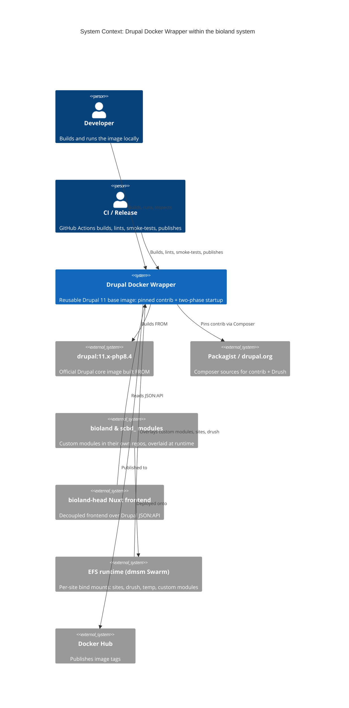
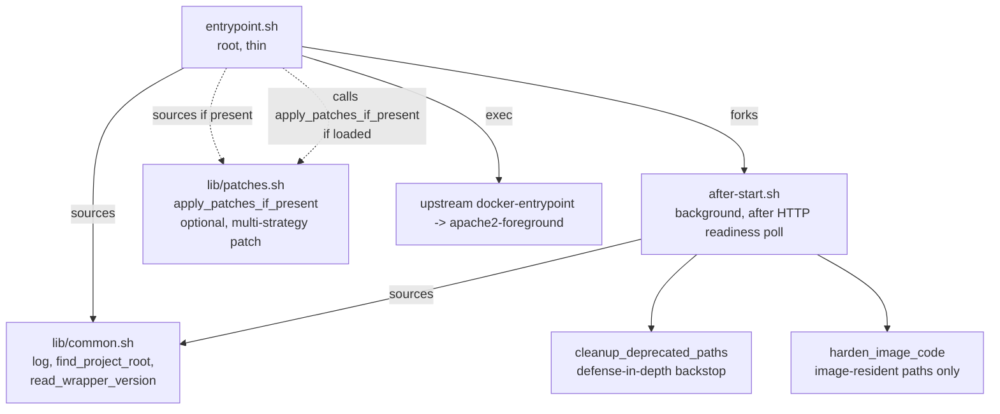
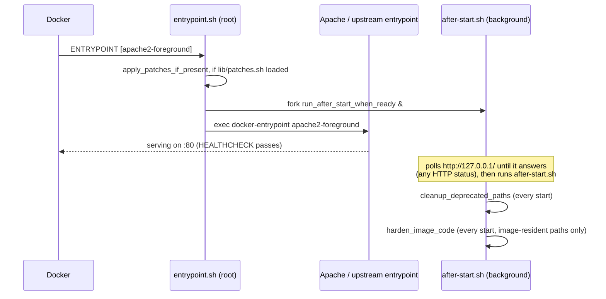
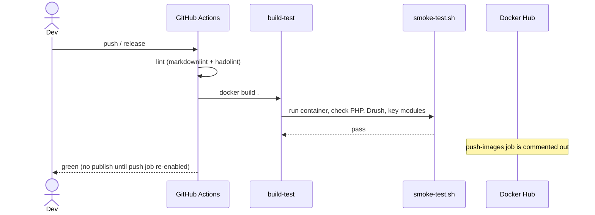
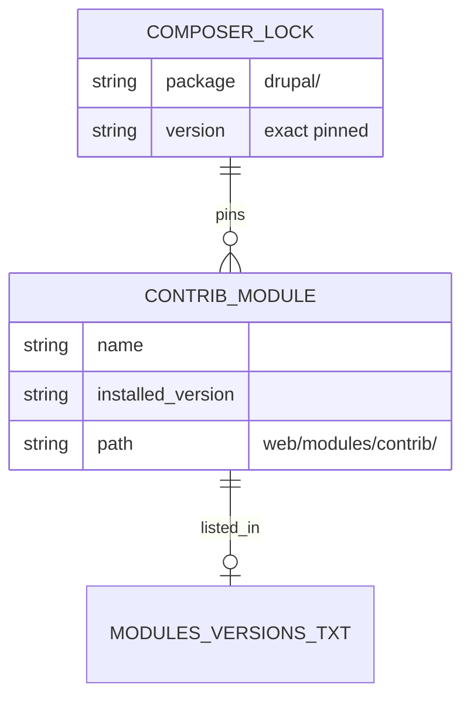
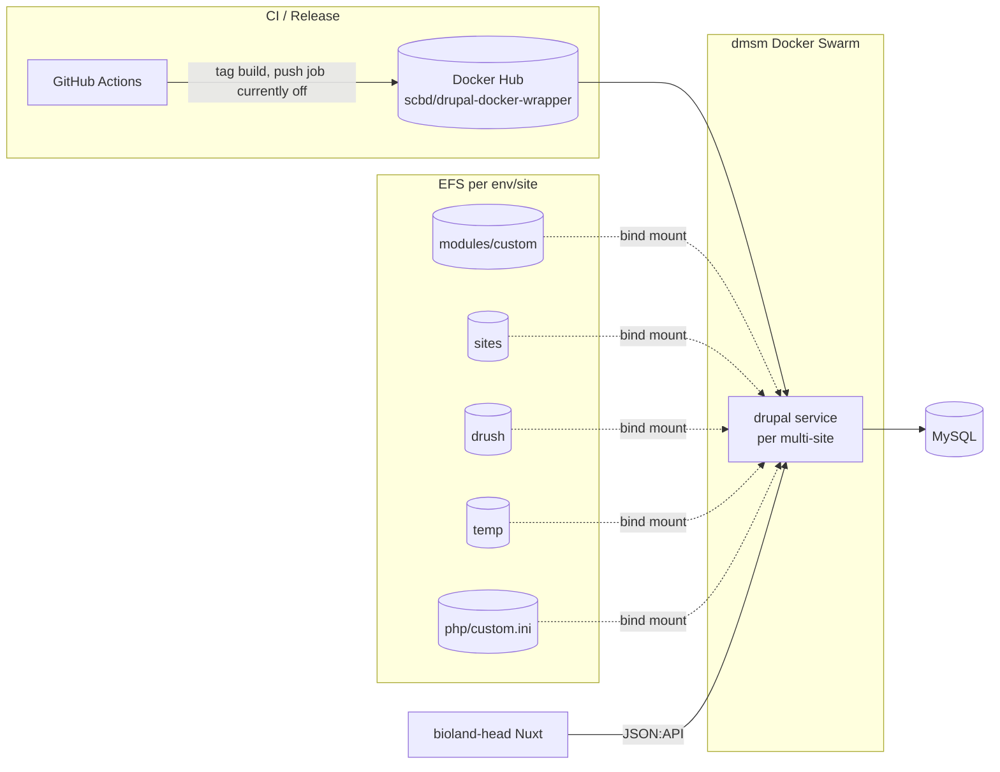

# Drupal Docker Wrapper Architecture

## 1. Overview

This repo builds one thing: a reusable Drupal 11 base Docker image (`scbd/drupal-docker-wrapper`)
that the wider bioland system runs as its CMS container. The image layers a fixed set of pinned
contrib modules, Drush, and CLI tooling on top of the official `drupal:11.x-php8.4` image, then adds
a two-phase startup that gets Apache serving immediately and defers the heavy provisioning to a
background script.

It is the build and runtime orchestration hub for the Drupal half of bioland. The custom modules
(`bioland`, the `scbd_*` family) live in their own repos and are overlaid at runtime; the
bioland-head Nuxt frontend consumes the Drupal JSON:API this image exposes. See `docs/prd.md` for
the product framing and `docs/CONTEXT.md` for the vocabulary used throughout.

The design's guarantee is structural, not corrective: the deployed stack bind-mounts exactly five
paths from EFS per site, and `modules/custom` is the only module path among them (see the
Deployment section for the full contract). Contrib, core, and vendor always come from the pinned
image and cannot drift, so there is no repair phase re-asserting a pin against drift. Build-time
pinning and the runtime mount contract speak one language about what is pinned versus overlaid, so
this is a single bounded context.

## 2. System Context (C4 L1)



> Mermaid C4 is experimental. If a renderer lacks C4 support, read this as: the wrapper image sits
> between the upstream Drupal image / Composer sources it consumes, the CI and developers who build
> it, and the EFS-backed Swarm runtime plus the Nuxt frontend that depend on it at run time. The
> custom modules and bioland-head are named conceptually; their code lives in other bioland repos.

## 3. Containers (C4 L2)

The image is one deployable artifact, but it is useful to see what is built into it and what is
overlaid at runtime.


The hard rule visible here: only `modules/custom`, `sites`, `drush`, `temp`, and the PHP ini are
safe to mount. Mounting the whole `modules` directory is a volume mask (see `docs/CONTEXT.md`) and
defeats the pin. Never mount `vendor/`, `web/core/`, or `modules/contrib/`.

## 4. Key Components (C4 L3)

### 4.1 Build stages

The `Dockerfile` is three stages, each adding one concern. Keeping module installs in their own
stage means a module bump invalidates only that layer's cache, not core.

```mermaid
flowchart LR
  subgraph base [base-core]
    b1[FROM drupal:11.4.5-php8.4]
    b2[System packages:<br/>curl, gosu, jq, nano,<br/>mysql client, unzip]
    b3[AWS CLI v2]
    b4[Rebuild GD with AVIF]
    b5[COPY patches/ into image]
    b6[Composer config:<br/>prefer dist, enable patching,<br/>skip robots.txt scaffold,<br/>ignore 3 guzzle advisories]
  end
  subgraph mods [with-modules]
    m1[Install build tools:<br/>git, patch, unzip]
    m2[Require composer-patches plugin FIRST]
    m3[Single composer require:<br/>~40 pinned modules + Drush]
    m4[Write modules-versions.txt<br/>and delete web/robots.txt]
    m6[Purge unzip]
  end
  subgraph fin [final]
    f1[zz-production.ini:<br/>disable assertions]
    f2[OCI image labels]
    f3[Symlink /var/www/html to web]
    f4[COPY package.json + scripts]
    f5[Composer home writable<br/>for www-data]
    f6[HEALTHCHECK + ENTRYPOINT]
  end
  base --> mods --> fin
```



Two details that surprise readers and are deliberate:

- The `composer-patches` plugin is required in its own step **before** the module `composer require`,
  because patches must be wired before any patched package is pulled.
- The `base-core` stage ignores three guzzle/psr7 security advisories
  (`PKSA-93qv-9n9h-6k6p`, `PKSA-k22t-f949-t9g6`, `PKSA-7qs6-zvnz-h66r`). This is a temporary BL-695
  measure so the Critical Drupal core fix shipped in 11.3.12 can build before patched guzzle/psr7
  releases exist in core's pinned ranges. It tracks Drupal issue #3599842 and is meant to be
  removed.

### 4.2 Startup scripts



`lib/patches.sh` is optional: if present, `entrypoint.sh` sources it and runs
`apply_patches_if_present` before Apache starts, applying any `.patch` files under `patches/` with
`git apply` - there is no `patch(1)` fallback - and skipping anything already applied, detected with
a `git apply --reverse --check` dry run rather than a marker file. A
missing `lib/patches.sh` is logged and skipped rather than treated as fatal, and a failing patch
step logs and continues rather than stopping the container from serving. Build-time patching via
`cweagans/composer-patches` runs independently at image build time and is unaffected either way.

## 5. Key Flows (sequence diagrams)

### 5.1 Container startup (two-phase)



The point of the fork is that the healthcheck never waits on after-start's work. Apache execs as
soon as entrypoint.sh reaches it; after-start only begins once `http://127.0.0.1/` actually answers
(any HTTP status counts, including a 301/403/500 mid-install), polled every
`DRUPAL_AFTER_START_READY_INTERVAL` seconds (default 2) for up to
`DRUPAL_AFTER_START_READY_TIMEOUT` seconds (default 120) before running anyway. Both passes run on
every start, ungated: neither touches a bind mount, so there is nothing expensive to skip and no
marker to keep. Nothing in the container tightens `settings*.php` or `services*.yml` under
`web/sites` any more - that is the deploy's responsibility now; see
[adr/0009](adr/0009-confine-after-start-to-image-code.md).
There is no cache rebuild step in after-start; see
[adr/0007](adr/0007-remove-broken-multisite-cache-rebuild-from-after-start.md).

### 5.2 CI build and release



## 6. Data Model

There is no application database in this repo; the "data" is the dependency manifest the build
produces and the runtime checks against. The entities below are build artifacts, not rows.



`composer.lock` is a build-time source of truth only: it pins every contrib module's exact version
when the image is built. Nothing reads it at runtime, because only `modules/custom` is ever
bind-mounted; contrib always comes from the image and has no drift to compare against.

## 7. State Machines

After-start has no branch left: cleanup and image-code hardening both run on every start,
unconditionally.

```mermaid
stateDiagram-v2
  [*] --> Cleanup: container start (cleanup_deprecated_paths, every start)
  Cleanup --> Hardening: harden_image_code (every start)
  Hardening --> Complete: image-resident paths hardened; failures counted, non-fatal
  Complete --> [*]
```

## 8. Deployment / Infrastructure



The deployed `drupal` service runs under the dmsm Swarm multi-site stacks (defined outside this
repo). Each site's stack bind-mounts exactly five paths from EFS: `php/custom.ini`,
`modules/custom`, `sites`, `drush`, and `temp`. The whole `modules` directory is never mounted, so
`web/modules/contrib`, `web/core`, and `vendor` always come from the pinned image and cannot drift.

## 9. Quality Attributes (NFRs)

| Attribute | Target | How the architecture meets it |
| --- | --- | --- |
| Reproducibility | Same image digest from same source | Every contrib module and Drush pinned to an exact version inline in the `Dockerfile`; `composer.lock` retained, never deleted |
| Determinism | No implicit upgrades between builds | Single consolidated `composer require` with explicit versions; `--prefer-dist`; lockfile kept; `composer outdated --direct` used for visibility, not auto-bumps |
| Startup latency | Apache serving in seconds | Thin entrypoint starts Apache immediately and exec-chains the upstream entrypoint; all heavy work is forked to the after-start phase |
| Idempotent provisioning | No provisioning work over network storage; image-code hardening runs every start | After-start touches no bind mount, so `harden_image_code` and cleanup are ungated, repeat safely, and only ever walk the image's own tree on local disk |
| Health observability | Container reports healthy independently of provisioning | HTTP `HEALTHCHECK` on `/` with a 40s start period; never blocked by patch application or drush |
| Security / least privilege | Web user cannot write code | Privilege separation: root only for permission fixes and port bind; code `root:www-data` read-only (dirs 755, files 644, `.htaccess` included); everything under the five bind mounts, `web/sites` included, is the deploy's responsibility (adr/0009); `gosu` is kept for an operator to run drush as www-data by hand |
| Supply-chain control | Auditable, explicit dependencies | Versions visible in the `Dockerfile`; `modules-versions.txt` manifest (`composer show --direct` output) for human-inspectable audit; `.dockerignore` keeps `.env*` and archived patches out of the build context |
| Image build efficiency | Fast incremental rebuilds | Multi-stage build; module installs isolated in `with-modules`; apt and Composer caches mounted; build-only tools purged before `final` |

## 10. Architecture Decisions

Recorded in `docs/adr/` (rationale lives there, not restated here):

- `docs/adr/0001-record-architecture-decisions.md` - adopt ADRs.
- `docs/adr/0002-pin-contrib-modules-in-a-dedicated-build-stage.md` - why contrib is pinned inline
  in its own stage rather than floating or split into a separate manifest.
- `docs/adr/0003-two-phase-startup-entrypoint-and-after-start.md` - why provisioning is forked off
  the entrypoint instead of blocking it.
- `docs/adr/0004-gate-after-start-with-a-per-version-marker.md` - why the one-time work was once
  gated on a version-stamped marker (superseded by 0009).
- `docs/adr/0005-remove-runtime-module-repair.md` - why runtime module repair and the per-module
  integrity hashes were removed.
- `docs/adr/0006-move-after-start-marker-to-the-mounted-volume.md` - why the marker moved off `/tmp`
  onto the mounted `temp/` volume (superseded by 0009).
- `docs/adr/0007-remove-broken-multisite-cache-rebuild-from-after-start.md` - why the after-start
  cache rebuild was removed, and why the per-site rebuild it used to attempt is now a deploy-process
  responsibility.
- `docs/adr/0008-remove-htaccess-hardening-from-after-start.md` - why the blanket `.htaccess` find
  over the whole project root was removed, and why it changed no resulting permission.
- `docs/adr/0009-confine-after-start-to-image-code.md` - why after-start no longer touches any bind
  mount, and why the version marker went with the work it existed to gate.

## 11. Risks & Open Questions

- **Startup patch application runs unconditionally when present.** `apply_patches_if_present` runs
  on every container start if `lib/patches.sh` shipped in the image, before Apache serves. It is
  idempotent (an already-applied patch is detected by a reverse dry-run and skipped) and a failure
  only logs and continues, but
  there is no way to disable it short of removing `lib/patches.sh` from the image.
- **Temporary advisory ignores.** Three guzzle/psr7 advisories are suppressed for BL-695 and must be
  removed once patched releases land in core's ranges (Drupal #3599842). Left in, they hide real
  future advisories on those packages.
- **Release publishing is off.** The GitHub Actions `push-images` job is commented out, so tagged releases
  build and test but do not publish until it is re-enabled with Docker Hub credentials.
- **No scheduled rebuild yet.** The README calls for a weekly rebuild to pick up upstream base-image
  security patches; that automation is not in place.
- **No cache rebuild after a deploy.** `after-start.sh` no longer rebuilds the Drupal cache. A
  deployment that ships new module or patch code must run a per-site `drush cache:rebuild` through
  the mounted drush aliases as a separate deploy step. Nothing in this image detects or enforces
  that; a deploy that skips it can serve from a stale service container or route table. See
  `docs/adr/0007-...`.
- **No in-container guarantee on any `web/sites` permission.** After-start does not touch the
  bind-mounted `sites/` tree at all: not `settings*.php`, not `services*.yml`, not
  `sites/*/files/.htaccess`. A mount that ships `settings.php` world-readable stays that way, and
  the `.htaccess` content still blocks PHP execution while its mode and owner are unmanaged here.
  The deploy that defines the mount, or an external operator-owned per-site script, is the only
  thing that can harden them. See `docs/adr/0008-...` and `docs/adr/0009-...`.
