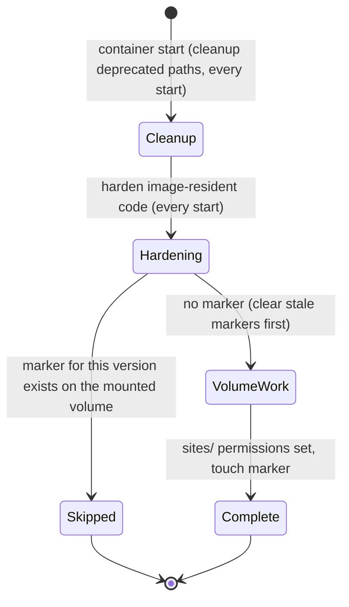

> Part of the Bioland architectural plan. The cross-project hub (System Overview,
> Actors, Workflow Statuses, End-to-End Flows, Verification, Deferred Items) is the
> hub; glossary: [CONTEXT.md](CONTEXT.md) (this repo's wrapper context) and the
> system [CONTEXT-MAP.md](CONTEXT-MAP.md). This doc owns the **Drupal Docker Wrapper** (Docker /
> Bash / Composer) work. Sibling spokes: Bioland Head, Drupal Module Bioland,
> Drupal Module SCBD Thesaurus Tags, and Drupal Module SCBD Field JS.
>
> This spoke's code lives in **this repo** (`scbd/drupal-docker-wrapper`), so its detail also has a
> single-context home in [architecture.md](../architecture.md), [prd.md](../prd.md), and
> [adr/](../adr/). This spoke is the cross-project slice; it links to those rather than restating them.

# Bioland: Drupal Docker Wrapper plan

This project is the **CMS runtime** of Bioland: a reusable Drupal 11 base Docker image
(`scbd/drupal-docker-wrapper`) that pins contrib at build time and keeps that pin intact through a
mount contract that never bind-mounts contrib at runtime. It is the host every other Drupal-side
project runs inside. The deep single-context view is this repo's
[architecture.md](../architecture.md); below is only what the rest of the system depends on.

## Owned interface (the seam)

The wrapper is a **deep module behind a runtime contract**. Almost all of its behaviour (multi-stage
build, ~40 pinned contrib modules, two-phase startup, permission hardening) is hidden; what other
projects actually depend on is a small, stable surface:

- **The runtime port - a Drupal 11 site that boots itself.** The image serves Apache on `:80`
  immediately and passes its `HEALTHCHECK` independently of provisioning. The custom-module spokes
  (`bioland`, `scbd_field`) depend on getting a working, pinned Drupal core + Drush + CLI tooling to
  run inside, not on knowing how it was built.
- **The mount contract (the load-bearing seam).** Exactly five paths are safe to bind-mount from EFS:
  `modules/custom`, `sites`, `drush`, `temp`, and the PHP `custom.ini`. **Never** mount `vendor/`,
  `web/core/`, or the whole `modules/` tree - that is a *volume mask* and it shadows the image's
  pinned contrib. This is the contract the dmsm Swarm deployment must honour for the pin to hold.
- **The custom-module overlay.** `drupal-module-bioland` and `scbd_field` are NOT baked into the
  image; they are overlaid at runtime under `modules/custom`. The wrapper guarantees they land in a
  Drupal that already has its contrib dependencies (`linkit`, `fontawesome`, `jsonapi_extras`, etc.)
  pinned and present.
- **The after-start guarantees.** On every container start, the wrapper cleans up deprecated paths
  and hardens image-resident code permissions (read-only `root:www-data`, `.htaccess` files inside
  those trees included). The `sites/*/files` permission pass runs once per image version per
  mounted volume, not on every start. The custom modules can assume this baseline; they do not run
  it themselves. There is no cache rebuild in this list; see
  [adr/0007](../adr/0007-remove-broken-multisite-cache-rebuild-from-after-start.md). There is also
  no `.htaccess` hardening under `sites/*/files` in this list any more; see
  [adr/0008](../adr/0008-remove-htaccess-hardening-from-after-start.md).

What is intentionally *not* in the interface: the build stages and the dormant startup patch
mechanism. Those are implementation, hidden behind the surface above.

## Connectors / Rules

- **Upstream / supply chain.** Builds `FROM drupal:11.x-php8.4`; pins every contrib module and Drush
  to an exact version inline in the `Dockerfile`; keeps `composer.lock`. Build-time patching via
  `cweagans/composer-patches` is live; three guzzle / psr7 advisories are temporarily suppressed for
  BL-695 (remove per Drupal #3599842).
- **CI / release adapter.** GitHub Actions lints (markdownlint + hadolint), builds, and smoke-tests; the
  `push-images` publish job is commented out, so releases build and test but do not push to Docker Hub.

See this repo's [adr/0002](../adr/0002-pin-contrib-modules-in-a-dedicated-build-stage.md),
[adr/0003](../adr/0003-two-phase-startup-entrypoint-and-after-start.md),
[adr/0004](../adr/0004-gate-after-start-with-a-per-version-marker.md),
[adr/0005](../adr/0005-remove-runtime-module-repair.md),
[adr/0006](../adr/0006-move-after-start-marker-to-the-mounted-volume.md),
[adr/0007](../adr/0007-remove-broken-multisite-cache-rebuild-from-after-start.md), and
[adr/0008](../adr/0008-remove-htaccess-hardening-from-after-start.md) for the decisions behind
these.

## Workflow transitions

The wrapper owns no part of the content / comment / translation workflow. It owns one **operational**
state machine: the after-start provisioning run. Only the `sites/` permission pass is gated, by a
marker on the mounted `temp/` volume (falling back to `/tmp` when no volume is mounted); cleanup and
image-code hardening run on every start. There is no cache-rebuild state; see
[adr/0007](../adr/0007-remove-broken-multisite-cache-rebuild-from-after-start.md).

This machine is self-contained: it touches no content state and is invisible over JSON:API, so the
hub's Workflow Statuses do not include it. A later container on the same volume short-circuits the
`sites/` pass to `Skipped`; an image upgrade clears stale markers and re-runs it. Cleanup and
hardening happen on every container regardless.
