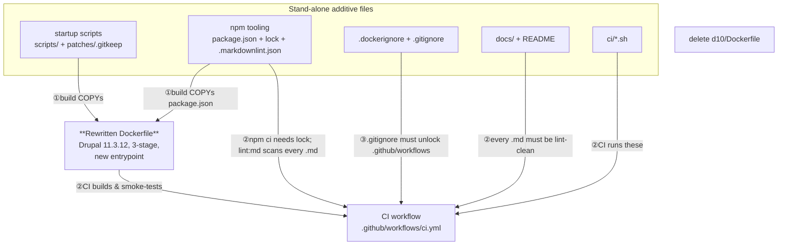
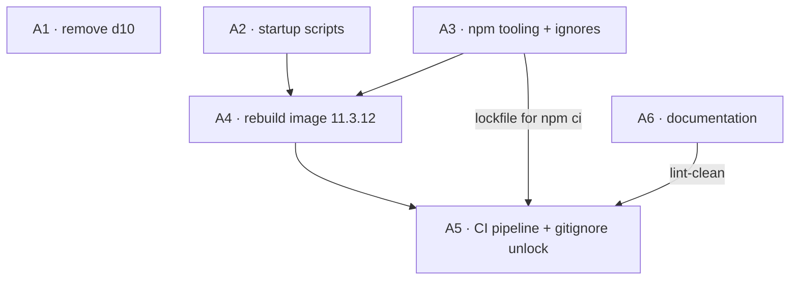
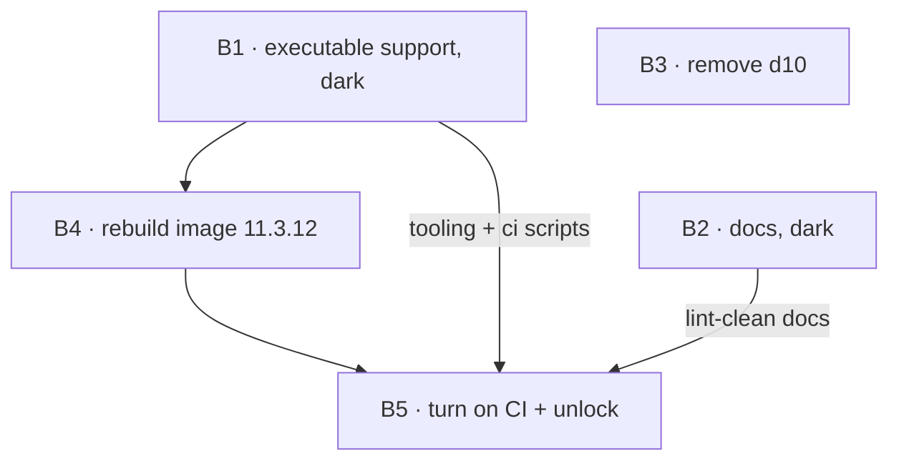
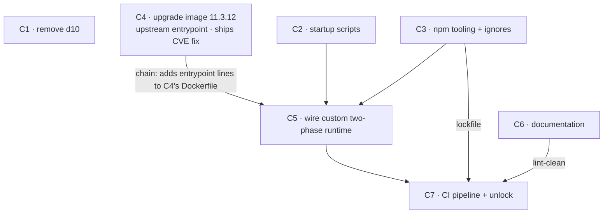

# Seam Review — splitting the `decom2` working tree into pull requests

> **What this is.** The `decom2` branch holds one big pile of uncommitted work. The plan is to
> reset this branch back to `master` at commit `ee61e1a` and re-land the work as a series of
> clean, reviewable pull requests. This document lays out **three different ways to cut that
> pile into PRs** so you can pick one. Nothing here changes code — it is a planning report.
>
> **Baseline:** `ee61e1a10d080d67e41e4b540873605d3203c6f5` (master).
> **Pile:** everything currently uncommitted in the working tree (inventory below).
> **Reviewed by:** the seam-critic and two devil's advocates — their findings are folded in
> throughout and summarised in [What the reviewers said](#what-the-reviewers-said).

---

## The whole pile, in one picture

Most of this pile is **brand-new files** the old image simply ignores. But it is **not** true that
there is only one constraint. There are really **four kinds of glue** holding files together, and
an early draft of this report missed three of them. Here they are:

1. **① Build-time glue** — the rewritten `Dockerfile` copies the scripts, `package.json` and
   `patches/` into the image, so it cannot build until those exist.
2. **② CI-time glue** — turning CI on needs *four* things at once: a Dockerfile that builds,
   `package.json` + `package-lock.json` (or `npm ci` aborts), the `ci/*.sh` scripts, and **every
   `.md` in the repo lint-clean** (markdownlint globs `**/*.md`, and `build-test` `needs: lint`).
3. **③ VCS glue** — today `.github` is fully git-ignored; the new `.gitignore` adds
   `!.github/workflows/`. Until that lands, `ci.yml` **cannot even be tracked**. So the
   `.gitignore` unlock must travel **with the CI PR**.
4. **④ Content glue (hidden, bidirectional)** — `ci/smoke-test.sh` asserts
   `web/modules/contrib/{jsonapi_extras,search_api}` exist. Those names are hard-coded to the
   Dockerfile's module list. Change the module set and you must revisit the smoke test, and vice
   versa — an arrow that points *both* ways.

**The takeaway:** the Dockerfile is the hinge, but **CI is the most-coupled PR in every option** —
it depends on the image, the npm tooling, the docs being clean, and the `.gitignore` unlock. Every
option below orders CI last for that reason.

---

## What's actually in the pile (plain inventory)

| # | Logical change | Files | Kind | Stands alone? |
|---|----------------|-------|------|---------------|
| 1 | Decommission the Drupal 10 image | delete `d10/Dockerfile` | move-only (removal) | **Yes** — nothing else builds it |
| 2 | Two-phase startup runtime | `scripts/{entrypoint,after-start}.sh`, `scripts/lib/{common,patches}.sh`, `patches/.gitkeep` | adds-new | **Yes** — old image never copies them. *(carries the risky `rm -rf` repair — see ⚠️)* |
| 3 | npm tooling + ignore rules | `package.json`, `package-lock.json`, `.markdownlint.json`, `.dockerignore`, `.gitignore` | config | **Yes**, but it is also a **CI prerequisite** (lockfile + lint config + workflow unlock) |
| 4 | Rebuild the image to Drupal 11.3.12 | `Dockerfile` (1-stage → 3-stage, ~40 pinned modules, GD/AVIF, AWS CLI, hashes, manifest, prod php.ini, entrypoint wiring, guzzle advisory-ignore) | **switches-it-on** | **No** — build copies #2 and #3; *(carries the guzzle CVE-ignore — see ⚠️)* |
| 5 | CI pipeline | `.github/workflows/ci.yml`, `ci/{lint,smoke-test,test-ci-locally}.sh` | adds-new (verifier) | **Only last** — needs #4 built, #3's lockfile, the `.gitignore` unlock, and #6 lint-clean; smoke-test is content-coupled to #4's module set |
| 6 | Documentation set | `README.md`, `docs/CONTEXT*.md`, `docs/prd.md`, `docs/architecture*.md`, `docs/drupal-docker-wrapper.md`, `docs/adr/000{1..4}*.md`, `docs/images/overview.svg` | adds-new (docs) | **Not cleanly** — describes the *new* image, embeds `overview.svg`, links `ci.yml`, has a version typo and dangling cross-repo links (see [Pre-cut fix-ups](#pre-cut-fix-ups)) |

> ⚠️ **Two risks must be named in their PR, never dark-shipped:**
> - `scripts/after-start.sh:211` runs **`rm -rf`** on any contrib module it judges stale (version
>   compare against `composer.lock`). It also forks from `entrypoint.sh:23` on a blind `sleep 60`
>   with a hard-coded path. The scripts PR description must call this out as a deliberate, reviewed
>   behaviour.
> - `Dockerfile:64` (with the rationale at `Dockerfile:51-57`) adds `policy.advisories.ignore-id`
>   to **suppress three guzzle/psr7 security advisories** (temporary, per BL-695, so the Critical
>   `SA-CORE-2026-005..009` core fix in 11.3.12 can build now). The image PR description must call
>   this out so it is a reviewed decision, not a silent one.

---

## Pre-cut fix-ups (do these to the pile *before* cutting any PR)

These are not seams — they are defects in the pile that any option inherits. Fix them once, up
front, so no option ships them:

1. **Version typo.** `Dockerfile` builds `11.3.12` and `package.json` is `11.3.12`, but
   `README.md` says `11.3.11` in seven places (`README.md:96,181,189-191,195,199,269`). Fix the
   README to `11.3.12` before the docs PR is cut. *(The image is wrong-by-a-patch-version in the
   docs today.)*
2. **Dangling cross-repo links.** The docs link a `docs/bioland.md` hub and `docs/bioland/*`
   sibling spokes (`docs/architectural-plan.md:8-13`, `docs/CONTEXT-MAP.md:16-20`,
   `docs/drupal-docker-wrapper.md:5-8`) that **do not exist in this repo** — they live in sibling
   `@bl2` repos. This does **not** break CI lint (markdownlint does not resolve relative file
   paths — verified), but it ships dead links on `master`. Before the docs PR: convert them to
   absolute GitHub URLs, add a "links resolve in the Bioland hub repo" banner, **or** defer the
   three hub-linking docs to a later PR that lands with the hub.

---

## Option A — cut by capability (incremental: additive-first, then activate)

**The defining idea.** Keep each capability whole and treat the image as one atomic artifact. Land
the small additive pieces first so the Dockerfile PR has its build inputs, flip the image, then
verify with CI. Medium grain, one clear job per PR.

| # | PR (one sentence, no "and") | Kind | Branches from | Stands alone? |
|---|-----------------------------|------|---------------|---------------|
| A1 | Remove the retired Drupal 10 image | move-only | master | PASS |
| A2 | Add the two-phase startup scripts, unused | adds-new | master | PASS — old image ignores them |
| A3 | Add npm tooling, markdownlint config, `.dockerignore` | config | master | PASS — nothing reads them yet |
| A4 | Rebuild the image to Drupal 11.3.12 with the new entrypoint | switches-it-on | master | PASS **after A2+A3** — build copies them |
| A5 | Add the CI pipeline **+ the `!.github/workflows/` gitignore unlock** | adds-new | master | PASS **after A3+A4 and once A6 is lint-clean** |
| A6 | Land the documentation set | docs | master | PASS — pure prose (after the pre-cut fixes) |

**Good about it.** Each PR is one capability a reviewer can hold in their head; the risky
Dockerfile is alone in A4; the `rm -rf` scripts get a focused review in A2. The only real
dependency arrows are the sanctioned "land additive, then switch on."

**Watch out for.** A5 (CI) has **three** real prerequisites — A4 (buildable image), A3 (lockfile +
markdownlint config), and A6 (lint-clean docs) — not just A4. The fix already applied above: the
`.gitignore` workflow-unlock now rides **in A5**, not A3, so A5 carries its own unlock and passes
the independence test cleanly. A3 is still a mild grab-bag (manifest + lint config + dockerignore),
but each is genuine project config.

---

## Option B — dark-ship: land everything dark, then one flip

**The defining idea.** A different *theory of seaming* from A and C: instead of landing pieces and
activating them, collapse **all** dark/additive content onto `master` first, so the behaviour flip
(the Dockerfile) has **zero prerequisite-merge coupling** — every input is already there. The flip
happens at exactly one reviewable moment.

The early draft made B a single 2,300-line "land everything" PR. Both devil's advocates flagged
that as a **review-safety defect** (a `rm -rf` shell runtime buried under 1,600 lines of docs gets
rubber-stamped). So B splits the dark landing into **two reviewable bundles** — executable vs prose
— which costs the strategy nothing (both are still fully additive and dark):

| # | PR (one sentence) | Kind | Branches from | Stands alone? |
|---|-------------------|------|---------------|---------------|
| B1 | Land all executable support dark: scripts, `ci/*.sh`, npm tooling, ignores | adds-new | master | PASS — old image/build ignore every one |
| B2 | Land the documentation set dark | docs | master | PASS — after pre-cut fixes |
| B3 | Remove the retired Drupal 10 image | move-only | master | PASS |
| B4 | Rebuild the image to Drupal 11.3.12 with the new entrypoint | switches-it-on | master | PASS **after B1** — all build inputs already landed |
| B5 | Turn on the CI workflow **+ gitignore unlock** | switches-it-on | master | PASS **after B4** — build green, scripts/tooling/docs already in |

**Good about it.** Fewest review surfaces. The Dockerfile flip (B4) is the *only* option where the
image PR has **no two-merge coupling** — every input is already on `master`. And because B1+B2
already landed the tooling and the docs, the CI PR (B5) inherits clean prerequisites "for free" —
B5's dependency set is the simplest of any option.

**Watch out for.** B1 is still a multi-discipline bundle (shell + CI + config) — keep the `rm -rf`
runtime callout prominent in its description so the risky part is not lost among the config. B2's
docs describe an image that B4 hasn't built yet, so `master` documents the future for a couple of
PRs (true of A6/C7 too, but most pronounced here because docs land first). If you truly want the
4-PR trophy, you can re-merge B1+B2 into one bundle — but both reviewers advise against it, and so
do I.

---

## Option C — split the image: ship the upgrade now, add the custom runtime next

**The defining idea.** A genuinely different *boundary* from A and B: those two treat the image as
one atomic change. C **cuts through the new Dockerfile itself** — but along a seam that actually
exists in the pile. It separates the **version/security upgrade** (the new 11.3.12 image with the
new module set, running the *upstream* Drupal entrypoint) from the **custom two-phase runtime** (the
`COPY scripts` + `package.json` + custom `ENTRYPOINT` at `Dockerfile:178,181-183,196`). The reason
this is worth doing: the upgrade carries the **Critical `SA-CORE-2026-005..009` core fix** (the very
reason the BL-695 guzzle-ignore exists), so C4 can ship that fix **without waiting** on review of
the riskier custom runtime (the `rm -rf` module-repair).

> This option was re-cut **twice** under review. The first draft was "8 thin PRs," which a devil's
> advocate showed was just Option A at finer grain (it *converged* with A). The second draft was
> "restructure to 3 stages at 11.2.2, then upgrade" — which the seam-critic showed was an **invalid
> seam**: no 3-stage-11.2.2 Dockerfile exists in the pile (it would be hand-fabricated throwaway
> code), and "contents unchanged" is impossible because the new multi-stage layout exists precisely
> to replace the old `rm composer.lock && composer install` hack. This third cut avoids both traps:
> C4 and C5 are a true subset/superset split of the **one** Dockerfile that exists — C4 is it minus
> the four entrypoint-wiring lines, C5 adds them back. The union rebuilds the real file exactly.

| # | PR (one sentence) | Kind | Branches from | Stands alone? |
|---|-------------------|------|---------------|---------------|
| C1 | Remove the retired Drupal 10 image | move-only | master | PASS |
| C2 | Add the two-phase startup scripts, unused | adds-new | master | PASS |
| C3 | Add npm tooling, markdownlint config, `.dockerignore` | config | master | PASS |
| C4 | **Upgrade the image to Drupal 11.3.12 with the upstream entrypoint** (incl. `patches/.gitkeep`) | switches-it-on | master | PASS — builds & runs; ships the core CVE fix; needs no scripts/`package.json` |
| C5 | **Wire the custom two-phase runtime** (`COPY scripts` + `package.json` + `ENTRYPOINT`) | switches-it-on | C4 | PASS **after C4 (chain) + C2 + C3** |
| C6 | Land the documentation set | docs | master | PASS — after pre-cut fixes |
| C7 | Add the CI pipeline **+ gitignore unlock** | adds-new | master | PASS **after C5, C3, C6** |

**Good about it.** The urgent part (a Critical core-security upgrade) ships in C4 **decoupled** from
the slowest, riskiest review (the `rm -rf` runtime), instead of being held hostage to it as in A.
Each half of the image gets a focused review: "is the upgraded image correct?" then "is the custom
startup correct?" C4 needs no scripts or `package.json`, so it is genuinely independent of C2/C3.

**Watch out for.** C4→C5 is a **declared chain** (C5 adds the entrypoint lines onto C4's Dockerfile)
— the only chain in any option — and it is the one option where the image runtime *changes twice*
(upstream entrypoint in C4, custom in C5), so C4 briefly ships an image whose module tree is *not*
runtime-repaired. That is fine (the upstream entrypoint is a valid, supported startup), but it is an
extra moving part. Only worth the chain if shipping the 11.3.12 core fix ahead of the runtime review
has real value to you.

---

## Side by side

| | **A — by capability** | **B — dark-ship** | **C — split the image** |
|---|---|---|---|
| PR count | 6 | 5 | 7 |
| Distinct *idea* | land additive, then activate | land everything dark, single flip | ship the upgrade, then add the runtime |
| Chains | none (merge-order only) | none (merge-order only) | **one** (C4 → C5) |
| Image reviewed as | one PR (A4) | one PR (B4) | **two** PRs (C4 upgrade, C5 runtime) |
| CI PR prerequisites | {A3, A4, A6} | {B1, B2, B4} | {C3, C5, C6} |
| Core CVE fix ships | with the runtime (A4) | with the runtime (B4) | **alone & first (C4)** |
| Biggest review risk | Dockerfile in A4 | B1 multi-discipline bundle | the C4→C5 chain |
| Overhead | medium | lowest | highest (one chain) |
| Best when | normal team review | merge fast, few eyes, accept coarse landings | the 11.3.12 core-security fix is time-critical |

All three obey the same glue (① build, ② CI, ③ unlock, ④ smoke-test↔modules). They differ on the
**idea of where the seams go**: A keeps capabilities whole, B collapses the additive content to
make the flip coupling-free, C splits the image so the urgent core upgrade ships ahead of the
custom runtime.

---

## What the reviewers said

Three independent skeptics reviewed the pile **and** these options. Their findings are folded into
the sections above; here is what each contributed and how it was applied.

### Seam-critic — verdict: A and B **PASS**; C re-cut **twice** to its current form; set is **distinct**

- Confirmed the build-time COPY couplings are real (`Dockerfile:47,178,181,182`) and that the
  image PR is genuinely not independently mergeable without the scripts/tooling.
- **Headline finding (applied to all options):** the report originally framed `package.json` as
  *only* a Dockerfile input. It is **also a CI-lint input** — `npm ci` needs the lockfile, and
  `lint:md` globs every `.md`, with `build-test` `needs: lint`. So the CI PR's true prerequisites
  are {buildable image, npm tooling, all docs lint-clean}. → Now stated explicitly in glue-②, the
  inventory, and every option's CI row.
- Advised moving the `.gitignore` unlock out of the tooling PR and into the CI PR. → Applied (A5 /
  B5 / C7 carry the unlock).
- **Second round (on the revised report):** confirmed the new option set is **SET-DISTINCT**, but
  caught that my first re-diversified Option C was an **invalid seam** — its lead PR ("restructure
  to 3 stages at Drupal 11.2.2, contents unchanged") describes an artifact that does **not exist in
  the pile** (the baseline is single-stage; a 3-stage 11.2.2 file would be hand-fabricated
  throwaway), and "contents unchanged" is unachievable because the multi-stage layout replaces the
  old `rm composer.lock && composer install` hack. → **Applied:** Option C re-cut a second time to
  the *upgrade-then-runtime* split above (C4/C5 are a true subset/superset of the real Dockerfile,
  so the cut is buildable from the actual pile). Also fixed the guzzle citation (`Dockerfile:64`,
  not `:99`).

### Devil's advocate #1 (code + couplings) — verdict: A minor re-cut, B re-cut B1, C redraw arrows

- Found the **CI-lint coupling** (independently of the seam-critic) and the **`.gitignore` ↔
  `ci.yml` atomicity** requirement. → Applied.
- Found the **hidden content coupling**: `ci/smoke-test.sh:24` asserts a specific module set, so
  it is welded to the Dockerfile's module list (bidirectional). → Now glue-④ + inventory note.
- Found the **docs are not "pure prose"**: README embeds `overview.svg`, links `ci.yml`, and the
  **version typo** (`11.3.11` vs `11.3.12`) plus the **dangling `bioland.md` hub link**. → Now the
  [Pre-cut fix-ups](#pre-cut-fix-ups) section.
- Insisted the **`rm -rf` module-repair and guzzle advisory-ignore must be called out**, never
  dark-shipped. → Now the ⚠️ callouts in the inventory and each option's watch-out.

### Devil's advocate #2 (seam strategy) — verdict: **A and C converged; re-diversify C**

- The decisive structural finding: the original Options A and C shared the same dependency spine,
  ordering, and philosophy — C was "A at finer grain," a granularity knob, not a rival design. →
  **Applied: Option C was re-diversified** into the refactor-vs-behaviour image split, which puts
  the seam in a genuinely different place. The set now spans three *ideas*, not two-and-a-half.
- Verified that the dangling hub links **do not break CI lint** (markdownlint has no path-resolving
  rule). → Recorded in the pre-cut fix-ups so the docs PR is known to stay green.
- Recommended **Option A** as the right count for a pile this size. → Weighed in the pick below.

---

## My pick — you choose

**Default to Option A. Switch to Option C if the 11.3.12 core-security fix is time-critical.** Do
the two pre-cut fix-ups first either way.

The real decision is a single question: **must the Critical `SA-CORE-2026-005..009` core upgrade
ship before the custom `rm -rf` runtime can be reviewed?**

- **If no (the normal case) → Option A.** Six PRs, each a single-discipline review, the risky
  Dockerfile alone in A4, no chain. A4 depending on two earlier additive merges (A2+A3) is the
  *sanctioned* "land additive, then activate" pattern, not a smell. This is the cleanest plan for a
  base image that ships a `rm -rf` runtime and a CVE suppression.
- **If yes → Option C.** Its whole reason to exist is that C4 ships the upgraded 11.3.12 image
  (with the upstream entrypoint) **without waiting** on review of the riskier two-phase runtime,
  which follows in C5. You pay one declared chain (C4→C5) for that decoupling. C is now a valid,
  buildable-from-the-pile plan — its earlier invalid form (a fabricated 11.2.2 intermediate) was
  re-cut after the seam-critic's second pass.

**Not Option B** as the primary choice: its one edge — a coupling-free image flip — is not worth
collapsing the `rm -rf` shell, the CI scripts, and the config into one multi-discipline PR (B1).
B is the right call only when you want it merged fast, with few reviewers, and can accept coarse
landings.

Recommended order for **A**: *fix-ups → A1 (decom) → A2 (scripts) ∥ A3 (tooling) → A4 (image) →
A6 (docs) → A5 (CI last).* Every PR passes the gate — *approve only this one, and `master` is still
correct and shippable* — and the only real dependencies are the visible, sanctioned ones. A and C
share everything except how the Dockerfile is cut, so you can start down A and split A4 into C4/C5
later if the core-fix urgency materialises.
