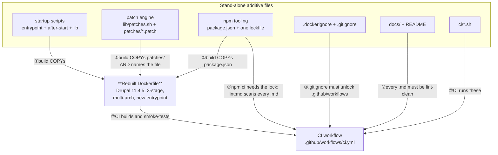
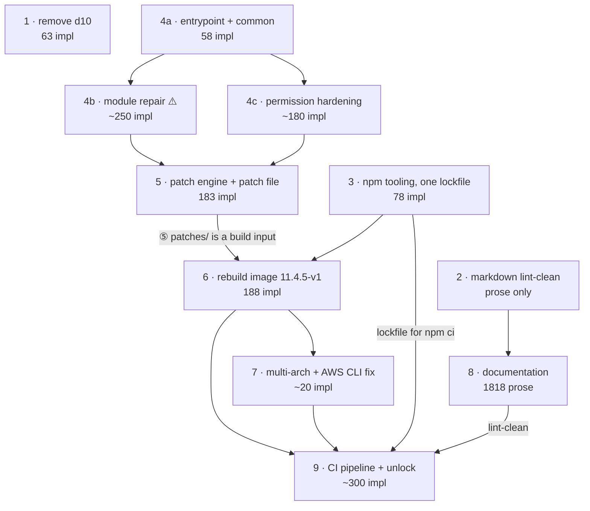

# Seam Review — landing `decom2` on `master` as reviewable pull requests

> **Status: FINAL (rev 2, 2026-08-23).** Rev 1 of this document proposed three options (A, B, C)
> for cutting an **uncommitted** pile targeting **Drupal 11.3.12**. Both premises are dead: the
> work is now **7 commits** and the target is **Drupal 11.4.5 / wrapper `11.4.5-v1`**. Rev 2
> retires the three-option format and finalises **one plan**, after a devil's-advocate pass by
> three independent critics and a war-game of the execution.
>
> **Baseline:** `master`. **Branch:** `decom2` (`14e65ef..a25c43d`), 31 files, +5207 / -143.
>
> **Read this first:** the re-land is **blocked** on four correctness defects and one CI wall.
> They are not seams — they are things that must be fixed or consciously accepted. See
> [Blockers](#blockers-fix-or-consciously-accept) and
> [Pre-cut fix-ups](#pre-cut-fix-ups).

---

## What changed since rev 1

| Rev 1 said | Reality on `decom2` today |
| --- | --- |
| One uncommitted pile; reset to `master` and re-land | 7 commits, 6 of them well-scoped and ticket-tagged |
| Target is Drupal 11.3.12 | `Dockerfile:4` is `FROM drupal:11.4.5-php8.4` |
| Fix-up: README says `11.3.11` in seven places | **Already fixed** — zero matches in `README.md` |
| Dangling hub links in three docs | Two were "fixed" to empty `(#)` anchors, which **breaks lint**; `docs/CONTEXT-MAP.md:3,16-20` still dangle |
| Docs are "pure prose", so the docs PR is safe | **False** — 136 markdownlint errors across 5 tracked files |
| `package.json` + `package-lock.json` are the npm inputs | Both `package-lock.json` **and** `yarn.lock` are committed, while `package.json:18` declares `packageManager: yarn@1.22.22` and CI runs `npm ci` |
| Option C exists to rush the Critical `SA-CORE-2026-005..009` fix | That fix shipped in 11.3.12; the tree is five releases past it. **C's reason to exist has expired** |

Three capabilities landed after rev 1 that **no option in rev 1 covered**: the runtime patch
engine, multi-platform build support, and the dual-lockfile contradiction.

### The commits, by reviewable weight

The LOC distribution is the single most important fact for choosing a strategy:

| Commit | Subject | Total | Non-doc, non-lockfile |
| --- | --- | --- | --- |
| `14e65ef` | `nodecomp` | +3986 / -139 | **+1114 / -138** |
| `f05a8db` | 11.4.1 + robots.txt fix (swaps lockfile to yarn) | +775 / -904 | +18 / -9 |
| `557a32a` | 11.4.2 + patch machinery | +140 / -23 | +132 / -19 |
| `e3a3f81` | 11.4.3 + permission-gating patch | +53 / -40 | +53 / -40 |
| `2ecdaf7` | 11.4.4 | +4 / -4 | +4 / -4 |
| `aef57f0` | 11.4.5 + multi-platform | +19 / -12 | +15 / -10 |
| `a25c43d` | 11.4.5-v1 + contrib bumps (re-adds npm lockfile) | +1292 / -83 | **+4 / -4** |

Commit 1 is the whole problem this document exists to solve. Commits 2-7 are already
PR-sized — but three of them are trivial (`2ecdaf7` is four lines) and the docs drifted **inside**
the bump chain, so replaying them verbatim would ship stale documentation.

---

## Blockers (fix, or consciously accept)

Found by the correctness critic and independently verified against source. The first two can
destroy a live site's contrib tree on an ordinary container restart.

### B1 — Self-triggering destroy-and-reinstall loop on every restart

`scripts/after-start.sh:167` flags a module for repair when its directory owner is not
`www_uid:www_gid` — which is `33:33` (`after-start.sh:66-67`). But `harden_mounted_volumes` later
runs `chown -R root:www-data` over `web/modules` (`after-start.sh:288`), leaving `0:33`. The
completion marker lives at `/tmp/after-start-<version>.complete` (`after-start.sh:22`), which does
**not** survive a restart.

So boot 2 sees all ~38 contrib modules as "incorrect directory ownership", `rm -rf`s every one of
them (`after-start.sh:211`), and re-runs a full `composer install`. Every restart, forever. On EFS
that is minutes of HTTP 500s per boot.

**Fix:** compare against the ownership hardening actually leaves (`0:${www_gid}`), or drop the
ownership heuristic and gate solely on the `composer.lock` version check. Move the marker off
`/tmp` to a persistent path under the project root.

### B2 — Destructive delete precedes a failure-tolerant restore

Every flagged module is `rm -rf`'d (`after-start.sh:205-218`) **before** `composer install` runs,
and that install's failure is swallowed (`after-start.sh:233-239`). If drupal.org is unreachable,
disk is full, or the archive extractor is missing (see M3), the modules are gone, the script logs
"continuing", and it still touches the completion marker.

**Fix:** never delete before the replacement is on disk. Restore to a temp dir and swap on
success; capture the install exit code; do not write the marker on failure.

### B3 — arm64 builds cannot succeed, so the multi-platform claim is false

`aef57f0` added `ARG TARGETARCH` and per-arch apt cache ids precisely so multi-arch builds do not
race on one apt lock (`Dockerfile:8,18,33,76,81,154`). But `Dockerfile:26` still hardcodes
`awscli-exe-linux-x86_64.zip`, and `./aws/install` then executes a bundled x86_64 binary — an
`linux/arm64` build dies with an exec-format error.

**Fix:** select the archive from `$TARGETARCH` (`amd64` to `x86_64`, `arm64` to `aarch64`). While
there, pin the AWS CLI version and verify its signature — today this is an unauthenticated
`curl` piped into a root-privileged install in every image.

### B4 — The "integrity hashes" are mis-generated and never verified

`Dockerfile:143-148` builds per-module SHA256 hashes, but `-a` binds tighter than `-o`, so the
expression parses as `(-type f -a -name "*.php") -o (-name "*.info.yml") -o (-name
"composer.json")` — the `-type f` guard covers only the `.php` branch. More seriously, nothing
reads these hashes at runtime, and `scripts/lib/patches.sh` mutates module files at startup, so
they are stale by design. `docs/architecture.md:323` is honest that they are "not machine-verified
at startup" — which means the docs advertise a control that does not run.

**Fix:** either parenthesise the `find` expression **and** add real startup verification, or
delete the hash generation together with the README and architecture claims about it. Do not ship
half of it.

### The CI wall — the docs are not lint-clean

Every plan orders CI last on the premise that the documentation is lint-clean. It is not:
`markdownlint-cli@0.49.0` over the tracked `.md` set reports **136 errors**.

| File | Errors |
| --- | --- |
| `docs/seam-review.md` (this file, before rev 2) | 51 |
| `docs/architectural-plan.md` | 45 |
| `README.md` | 28 |
| `docs/drupal-docker-wrapper.md` | 6 |
| `docs/architecture.md` | 6 |

Dominated by MD060 (table column style) and MD042 (empty links — the `(#)` anchors at
`docs/architectural-plan.md:6-13,29` and `docs/drupal-docker-wrapper.md:1-8` that were introduced
as the "fix" for the dangling hub links). Until this is cleared, the CI PR can never go green.

### Majors worth naming in a PR body

| # | Where | Finding |
| --- | --- | --- |
| M1 | `Dockerfile:118` | `drupal/jsonapi_extras:3.x-dev@dev` floats, in an image whose stated value is reproducible pinning; no `composer.lock` is tracked. The pinned `3.27` sits commented at `Dockerfile:149` |
| M2 | `Dockerfile:55-70` | The guzzle/psr7 advisory suppression still justifies itself by "the fix shipped in 11.3.12" while the base is 11.4.5. Nobody has re-tested whether it is still needed |
| M3 | `Dockerfile:156` | `unzip` is purged, but `after-start.sh` runs `composer install --prefer-dist` at runtime. Combined with B2, a failure here means deleted modules and no restore |
| M4 | `after-start.sh:351` | `chmod -R 755` over `web/sites` leaves **`settings.php` world-readable** — it holds DB credentials and the hash salt |
| M5 | `ci.yml:50` | Plain `docker build`, no buildx, no `--platform`. CI would never catch B3 |
| M6 | `ci/lint.sh:11` | Dual lockfiles with contradictory tooling (see below). Green today by luck — the two locks happen to agree |
| M7 | `ci/smoke-test.sh:15` | The smoke test sleeps 12s; `after-start.sh` is scheduled at T+60s. **The riskiest code in the repo is never exercised in CI**, nor is `patches.sh` |
| M8 | `entrypoint.sh:26` | Blind `sleep 60`, exit code discarded. The healthcheck goes unhealthy mid-repair, the orchestrator restarts, the repair restarts — B1 never converges |
| M9 | `patches.sh:70-96` | The `patch(1)` fallback applies hunk-by-hunk, so a mid-way failure leaves a partial apply that the `--fuzz=3` retry can double-apply. `git` is kept in the image, so this path is dead code carrying live risk |
| M10 | `after-start.sh:174-182` | A hand-placed module in `web/modules/contrib` is `rm -rf`'d and never restored, because `composer install` does not know about it |

---

## The glue holding the pile together

Five kinds of coupling, up from four in rev 1. The new one is ⑤.

1. **① Build-time glue.** The Dockerfile copies the scripts and `package.json` into the image
   (`Dockerfile:185,188-189`), so it cannot build until those exist.
2. **② CI-time glue.** Turning CI on needs four things at once: a Dockerfile that builds, the
   npm tooling plus its lockfile, the `ci/*.sh` scripts, and **every tracked `.md` lint-clean**
   (`build-test` has `needs: lint`).
3. **③ VCS glue.** `master` git-ignores `.github` wholesale; the branch changes this to
   `.github/*` plus `!.github/workflows/`. Until that lands, `ci.yml` cannot even be tracked, so
   the unlock must travel **with** the CI PR.
4. **④ Content glue (bidirectional).** `ci/smoke-test.sh:24` asserts
   `web/modules/contrib/{jsonapi_extras,search_api}` exist, hard-coding names from the
   Dockerfile's module list. Worse now: one side of that weld floats (M1).
5. **⑤ Patch glue (new, and it is atomic).** `Dockerfile:51` copies `./patches/` in the **first**
   build stage and `Dockerfile:67` names
   `patches/auto_node_translate--2026-07-15--3609236--gate-on-permission.patch` literally. If that
   file is absent, the build fails. This is not additive-but-unused the way `patches/.gitkeep`
   was — it is a hard build input. Separately, `entrypoint.sh:12,21` sources the patch engine and
   applies discovered patches **synchronously, before Apache starts**, so `patches.sh` is now a
   runtime behaviour change rather than inert scaffolding.

**The takeaway is unchanged but sharper:** the Dockerfile is the hinge, CI is the most-coupled PR,
and the patch engine has become a second thing that must land before the image can build.

---

## Inventory

| # | Logical change | Files | Kind | Stands alone? |
| --- | --- | --- | --- | --- |
| 1 | Decommission the Drupal 10 image | delete `d10/Dockerfile` | move-only | **Yes** — nothing builds it |
| 2 | Two-phase startup runtime | `scripts/{entrypoint,after-start}.sh`, `scripts/lib/common.sh` | adds-new | **Yes**, but carries B1, B2, M4, M8, M10 |
| 3 | Runtime patch engine | `scripts/lib/patches.sh`, `patches/*.patch`, `patches/.gitkeep` | adds-new | **Yes** as files; becomes a build input at #5 and a runtime behaviour at `entrypoint.sh:21` |
| 4 | npm tooling and ignore rules | `package.json`, one lockfile, `.markdownlint.json`, `.dockerignore`, `.gitignore` | config | **Yes**, once the dual-lockfile contradiction is resolved |
| 5 | Rebuild the image to Drupal 11.4.5-v1 | `Dockerfile` (1-stage to 3-stage, ~38 pinned modules, GD/AVIF, AWS CLI, hashes, manifest, prod php.ini, entrypoint wiring) | switches-it-on | **No** — needs #2, #3, #4; carries M1, M2, M3, B4 |
| 6 | Multi-platform build support | `Dockerfile` `TARGETARCH` args and per-arch apt caches | adds-new | **Yes** on top of #5, but **broken** until B3 is fixed |
| 7 | CI pipeline | `.github/workflows/ci.yml`, `ci/{lint,smoke-test,test-ci-locally}.sh` | adds-new | **Only last** — see glue ② and ③ |
| 8 | Documentation set | `README.md`, `docs/CONTEXT*.md`, `docs/prd.md`, `docs/architecture*.md`, `docs/drupal-docker-wrapper.md`, `docs/adr/000{1..4}*.md`, `docs/images/overview.svg` | docs | **Not until lint-clean**, and the prose is four patch versions stale |

> ⚠️ **Three risks must be named in their PR body, never dark-shipped:**
>
> - `scripts/after-start.sh:211` **and `:257`** both run `rm -rf` (rev 1 named only the first).
>   With B1 and B2 unfixed, this is a data-destruction path on an ordinary restart.
> - `Dockerfile:70` suppresses three guzzle/psr7 security advisories per BL-695, on a rationale
>   that predates the current base image (M2).
> - `scripts/entrypoint.sh:21` applies **any** discovered `.patch` file to the contrib tree at
>   every container start, synchronously, before Apache.

---

## Pre-cut fix-ups

Defects in the pile that any plan inherits. Fix them once, before cutting.

**P1 — Make the tracked markdown lint-clean.** 136 errors; this blocks the CI PR outright. Give
the `(#)` placeholders in `docs/architectural-plan.md:6-13,29` and
`docs/drupal-docker-wrapper.md:1-8` real absolute GitHub URLs, do the same for the still-relative
hub links at `docs/CONTEXT-MAP.md:3,16-20`, and fix MD060 table style repo-wide.

**P2 — Resolve the package-manager contradiction.** `package-lock.json` and `yarn.lock` are both
committed; `package.json:18` declares `packageManager: yarn@1.22.22`; `ci/lint.sh:11` runs
`npm ci` and `ci.yml:31` sets `cache: npm`. The two locks agree **today**, so CI is green by luck —
the first `yarn add` updates only `yarn.lock` while CI keeps installing from a stale npm lock, and
the tool that gates every other PR silently diverges. *Recommended:* delete `yarn.lock` and the
`packageManager` field, keep npm — it matches CI as written and needs zero workflow edits. Pin the
two caret-ranged devDependencies exactly while you are there.

**P3 — Re-test the BL-695 advisory suppression at 11.4.5.** Build once with
`policy.advisories.ignore-id` removed. If it builds clean, delete the block and the ⚠️ disappears
from the plan entirely. If it does not, correct the stale 11.3.12 rationale at `Dockerfile:55-61`
and give it an expiry date.

**P4 — Resync the docs to 11.4.5-v1.** The bump chain left the prose behind: `docs/architecture.md:106,138`,
`docs/architectural-plan.md:177,209,481`, `docs/prd.md:128` and `docs/CONTEXT.md:110` all still say
**11.4.1** while `Dockerfile:4` says 11.4.5. Landing as-is means documentation that is four patch
versions stale on day one.

**P5 — Decide this document's fate.** Rev 1 was tracked inside `14e65ef` and was the single worst
lint offender (51 of the 136 errors). Rev 2 is written lint-clean, but it is still process
ephemera describing a re-land rather than project documentation. *Recommended:* keep it until the
re-land completes, then delete it in the final PR.

**Dropped from rev 1:** the README `11.3.11` version typo — already fixed, zero matches remain.

---

## The plan

Rev 1's three options are retired. Here is why, and what replaces them.

**Why A and B collapsed into each other.** B's only claimed edge was "the Dockerfile flip has zero
prerequisite-merge coupling." But A already orders its additive PRs before the image, so by the
time the image is reviewed its inputs are on `master` in both — identical state, different
paragraph. What remained was a bundling knob, not a theory of seaming. That is exactly the test
rev 1 applied to kill the first draft of Option C.

**Why C is dead.** C existed to ship the Critical `SA-CORE-2026-005..009` core fix ahead of the
risky runtime review. That fix shipped in 11.3.12 and `Dockerfile:4` is now 11.4.5. Its
load-bearing claim — "C4 needs no scripts or `package.json`" — is also false now that
`Dockerfile:51` copies `patches/` in the first build stage.

**Why not simply stack the existing 7 commits.** Tempting, and it would preserve the ticket-tagged
history — but PR #1 would still be the 4000-line `nodecomp` blob, which is the entire problem.
Conversely, a full reset-and-re-cut throws away five well-scoped commits for nothing.

**The plan is a hybrid:** re-cut **only** `14e65ef` into seams, and fold the six later commits into
the PRs where their content belongs. One PR per Drupal version bump is explicitly rejected —
`2ecdaf7` is a four-line change and `a25c43d` is four non-lockfile lines, so per-version PRs are
pure review overhead, and replaying them verbatim would preserve the doc drift P4 exists to fix.

### The PRs

LOC counts are from `git diff master...decom2 --numstat`. **Impl** is implementation code — the
number the ~200 target and 400 ceiling apply to. **Other** is generated lockfiles, prose, patch
data, and SVG, which do not count against the ceiling.

| # | PR (one sentence, no "and") | Kind | Impl LOC | Other LOC | Source | Depends on |
| --- | --- | --- | --- | --- | --- | --- |
| 1 | Remove the retired Drupal 10 image | move-only | 63 (all deletions) | — | `14e65ef` | — |
| 2 | Make the tracked markdown lint-clean | prep | — | ~136 touched | P1 | — |
| 3 | Add npm tooling, lint config, and ignore rules on one package manager | config | 78 | 1209 lockfile | `14e65ef` + P2 | — |
| 4 | Add the two-phase startup scripts, inert | adds-new | **486** ⚠️ | — | `14e65ef` | — |
| 5 | Add the runtime patch engine and the `auto_node_translate` patch | adds-new | 183 | 49 patch | `557a32a` + `e3a3f81` | 4 |
| 6 | Rebuild the image to Drupal 11.4.5-v1 with the new entrypoint | switches-it-on | 188 / -68 | — | `14e65ef` + all bumps | 3, 4, 5 |
| 7 | Enable multi-platform builds and fix the x86-pinned AWS CLI | adds-new | ~20 | — | `aef57f0` + B3 | 6 |
| 8 | Land the documentation set at 11.4.5-v1 | docs | — | **1818** | `14e65ef` + P4 | 2 |
| 9 | Add the CI pipeline with the workflow gitignore unlock | adds-new | ~300 | — | `14e65ef` + M5 | 3, 6, 7, 8 |

**Two rows break the sizing rules and need a decision.**

**PR 4 at 486 impl LOC is over the 400 hard ceiling**, and the blocker fixes (B1, B2, M4, M8, M10)
will push it higher. It is one file doing it: `after-start.sh` is 428 lines on its own, with
`entrypoint.sh` (38) and `lib/common.sh` (20) making up the rest. The honest split is by function
rather than by file:

| Split | Contents | Impl LOC |
| --- | --- | --- |
| 4a | `entrypoint.sh` + `lib/common.sh` — the thin wrapper and shared helpers | 58 |
| 4b | `after-start.sh` module repair — the `rm -rf` path plus B1, B2, M10 fixes | ~250 |
| 4c | `after-start.sh` permission hardening and cleanup — plus the M4 fix | ~180 |

That is worth doing regardless of the ceiling: 4b is the destructive path and deserves its own
focused review, which is exactly what a 486-line PR would deny it. 4a must land first (4b and 4c
are functions the wrapper calls), so this adds two merges, not two review surfaces' worth of risk.

**PR 8 at 1818 lines is enormous but is entirely prose**, so the ceiling does not apply. Split it
only if reviewers ask — the natural line is the four ADRs plus `CONTEXT*.md` (316 lines, the
durable design record) separate from `README.md` plus the plan and architecture docs (1502).

**PR 9 at ~300** is at the upper end but coherent, and it is the one PR that cannot be split: the
workflow, its scripts, and the `.gitignore` unlock must land atomically (glue ③).

**Recommended order:** P1–P5 fix-ups, then *1 and 2 in parallel, 3, 4, 5, 6, 7, 8, 9 last.*

### Where each blocker lands

| Blocker | Lands in | Disposition |
| --- | --- | --- |
| B1, B2, M4, M8, M10 | PR 4 | **Fix before landing.** These are data-destruction paths, not disclosures |
| M9 | PR 5 | Delete the `patch(1)` fallback — `git` is kept in the image, so it is dead code |
| B4, M1, M2, M3 | PR 6 | Disclose in the body; M2 may vanish via P3 |
| B3 | PR 7 | Fix is the point of the PR |
| M5, M7 | PR 9 | Add buildx, and make the smoke test actually exercise `after-start.sh` |

**M7 deserves emphasis.** A smoke test that overrides the 60-second delay, waits for the
completion marker, then asserts that every module in `modules-versions.txt` still has a directory
and that `settings.php` is not world-readable would have caught B1, B2 and M4 by itself. It is the
highest-value single addition in this plan.

---

## War-game of the re-land

The plan above is the blue-sky path. This section fights it move by move — depth 2, executor tier
T2–T3 (a trigger-following model). Per move: the action, the observation that means it worked, the
most likely failure with its signals, and the pre-decided countermove.

### Recon (before move 1)

- Confirm `master` is unchanged since `decom2` forked: `git merge-base --is-ancestor master decom2`.
- Confirm the lint baseline: `npx markdownlint-cli@0.49.0 $(git ls-files '*.md')` reports 136.
- Confirm both lockfiles resolve the same three devDependencies (they do today — this is the
  fact that makes P2 safe to do as a delete rather than a regeneration).
- Confirm a local Docker build of `decom2` HEAD succeeds on amd64 before cutting anything. If the
  branch does not build today, every downstream move is guesswork.

### Move 1 — Fix-up P2 (one package manager)

- **Action:** delete `yarn.lock` and the `packageManager` field; pin the two devDependencies.
- **Expect:** `npm ci` succeeds; `npm run lint:md` runs and reports the same 136 errors.
- **Likely failure:** the pinned exact versions resolve differently from the caret ranges and the
  error count *changes*. Cause: `markdownlint-cli@^0.49.0` had floated. Signals: a different
  error total, or new rule ids.
- **Countermove:** pin to whatever versions the current lockfile already resolves, not to the
  latest. The point is to freeze today's behaviour, not to upgrade.

### Move 2 — Fix-up P1 (lint-clean the markdown)

- **Action:** fix MD042 empty links and MD060 table style across the five offending files.
- **Expect:** `npx markdownlint-cli@0.49.0 $(git ls-files '*.md')` exits 0.
- **Likely failure:** fixing MD042 by pointing the hub links at absolute GitHub URLs for sibling
  `@bl2` repos that are private or not yet pushed — the links lint clean but 404 for reviewers.
  Signals: a reviewer reports a dead link; the target repo is not public.
- **Countermove:** prefer a short "these resolve in the Bioland hub repo" note plus plain text
  over a URL you cannot verify resolves. Lint does not resolve paths, so plain text is safe.
- **Second-order:** clearing lint locally does not prove CI clean — CI checks out without
  `graphify-out/`, which contributes 34 gitignored errors locally. Verify against
  `git ls-files`, never a bare glob.

### Move 3 — PRs 1 and 2 (remove d10, land the lint fixes)

- **Action:** open both against `master`.
- **Expect:** both merge with no CI (the workflow does not exist yet).
- **Likely failure:** none plausible. PR 1 deletes a file nothing references; PR 2 is prose.
- **Countermove:** n/a. These are the two safe moves; do them first to build confidence.

### Move 4 — PR 3 (npm tooling and ignores)

- **Action:** land `package.json`, the single lockfile, `.markdownlint.json`, `.dockerignore`,
  and the `.gitignore` changes **minus** the `!.github/workflows/` unlock.
- **Expect:** `master` gains the tooling; nothing reads it yet.
- **Likely failure:** the `.gitignore` split is fumbled and the workflow unlock rides along early.
  Cause: it is one hunk in the original diff. Signals: `git check-ignore .github/workflows/ci.yml`
  returns nothing on `master` before PR 9.
- **Countermove:** split the hunk deliberately. The AI-tooling and scratch entries
  (`.vscode`, `graphify-out`, `docs/.temp`, `backlog.jsonl`) belong here; the workflow unlock
  belongs with PR 9 and nowhere else.

### Move 5 — PR 4 (startup scripts) — the highest-risk move

- **Action:** land `entrypoint.sh`, `after-start.sh`, `lib/common.sh` **with B1, B2, M4, M8 and
  M10 fixed**, inert (nothing copies them into an image yet).
- **Expect:** files on `master`; no image behaviour changes; the PR body carries the `rm -rf`
  blast-radius section.
- **Likely failure:** the B1 fix is made by changing the *hardening* to leave `33:33` instead of
  changing the *heuristic*. Cause: it is the smaller diff. Signals: `harden_mounted_volumes` no
  longer chowns code to `root:www-data`. That silently reverts the security posture the
  hardening exists for — code becomes writable by the web server user.
- **Countermove:** fix the heuristic, not the hardening. The correct comparison target is the
  post-hardening state `0:${www_gid}`.
- **Second-order:** with B2 fixed to a temp-dir-and-swap, disk pressure becomes a new failure mode
  on EFS-backed volumes — the repair now needs headroom for a second copy of a module tree. Log
  free space before the swap and skip the repair rather than half-completing it.

### Fork F1 — Does the advisory suppression survive P3?

- **Trigger:** build once at 11.4.5 with `policy.advisories.ignore-id` removed.
  - **Clean build** to Route A: delete the block; PR 6 loses one ⚠️ and one disclosure.
  - **Build fails on advisories** to Route B: keep the block, rewrite the rationale comment to
    cite 11.4.5 and the live upstream issue, add an expiry date, and disclose it in PR 6.

### Move 6 — PR 5 (patch engine)

- **Action:** land `lib/patches.sh` (with the `patch(1)` fallback deleted per M9) and the patch
  file.
- **Expect:** files on `master`; `entrypoint.sh` already sources them but no image ships yet.
- **Likely failure:** the patch is validated only by "it applies", not by "it applies to the
  version we pin". `auto_node_translate:3.0.2` is pinned at `Dockerfile:101`; a patch cut against
  a different revision may apply with fuzz and silently corrupt the module.
- **Countermove:** validate with a strict `git apply --check` against an unpacked 3.0.2, and fail
  the build rather than fuzz. Record the validated module version in the PR body.

### Move 7 — PR 6 (rebuild the image)

- **Action:** land the 3-stage Dockerfile at 11.4.5-v1.
- **Expect:** `docker build .` succeeds on amd64; the container serves HTTP 200; the contrib tree
  contains the pinned module set.
- **Likely failure:** the build succeeds locally from cache but fails clean. Cause: `jsonapi_extras:3.x-dev@dev`
  resolves to a different commit than the cached one (M1). Signals: a `composer require` conflict
  that did not occur yesterday, or a smoke test that passes locally and fails in CI.
- **Countermove:** pin `jsonapi_extras` in this PR. If it genuinely must float, say so explicitly
  in the PR body next to the guzzle disclosure, and accept that PR 9's smoke test is a flake
  source.
- **Second-order:** this is the first PR where `master` ships a runtime that runs `after-start.sh`.
  Even with B1 fixed, the first real deployment is the moment the repair logic meets a live EFS
  volume. Do not merge PR 6 on a Friday.

### Move 8 — PR 7 (multi-arch)

- **Action:** parameterise the AWS CLI archive by `$TARGETARCH` and confirm both arches build.
- **Expect:** `docker buildx build --platform linux/amd64,linux/arm64 .` succeeds.
- **Likely failure:** arm64 fails somewhere *else* than the AWS CLI — the GD rebuild or a contrib
  module with a native dependency. Cause: nobody has ever built this arm64. Signals: a compile
  error in the `docker-php-ext-install gd` layer.
- **Countermove:** this PR's scope is "make the multi-arch claim true **or** withdraw it." If
  arm64 cannot build, delete the `TARGETARCH` args rather than shipping aspirational ones, and
  say so. A false capability claim is worse than no claim.

### Move 9 — PR 8 (documentation)

- **Action:** land the docs, resynced to 11.4.5-v1 per P4.
- **Expect:** lint stays clean; the prose matches the image on `master`.
- **Likely failure:** the resync misses a reference, so the docs claim 11.4.5 in most places and
  11.4.1 in one. Signals: `grep -rn "11\.4\.[0-4]" docs/ README.md` returns a hit.
- **Countermove:** make that grep the PR's acceptance check, not a reading pass.

### Move 10 — PR 9 (CI, last)

- **Action:** land `ci.yml` **with** the `!.github/workflows/` unlock in the same commit, plus
  buildx (M5) and the strengthened smoke test (M7).
- **Expect:** the first CI run on the PR itself goes green — lint, then build, then smoke.
- **Likely failure:** the workflow file cannot be committed at all. Cause: `.gitignore` on
  `master` still excludes it (glue ③) and `git add` silently no-ops. Signals: `git status` shows
  nothing after adding the file.
- **Countermove:** stage the `.gitignore` change **first** in the same branch, then add the
  workflow. Verify with `git check-ignore -v .github/workflows/ci.yml` returning nothing before
  committing.
- **Second-order:** the strengthened smoke test is the first thing that has ever exercised
  `after-start.sh`. Expect it to fail on the first run and to surface at least one defect beyond
  B1/B2. Budget for that rather than treating a red first run as a CI misconfiguration.

### Assumptions (flagged, not silently resolved)

- **(VARIABLE: arm64 is actually wanted.)** The plan assumes multi-arch is a real requirement. If
  nothing consumes an arm64 image, PR 7 should delete the `TARGETARCH` work instead of fixing it.
- **(VARIABLE: the sibling `@bl2` hub repos' visibility.)** P1's link fix depends on whether those
  repos are reachable to reviewers.
- **(VARIABLE: whether a live advisory affects 11.4.5.)** Fork F1 resolves this empirically, but
  if one exists, the urgency framing rev 1 attached to Option C returns and PR 6 may need to jump
  the queue.
- **Assumed and acted on:** that the two lockfiles agreeing today makes P2 a safe delete. Verified
  for the three declared devDependencies; not verified transitively.

### Abort conditions

Stop and escalate rather than improvising if any of these occur:

- `decom2` HEAD does not build on amd64 during recon — the whole plan rests on a buildable branch.
- The B1 fix cannot be made without weakening `harden_mounted_volumes` — that is a security
  trade-off, not an implementation detail.
- Two consecutive CI runs fail in PR 9 for reasons not covered by a countermove above.
- Any move requires force-pushing, closing, or deleting an already-open PR in this chain.

### Verification (what "done" means)

- All nine PRs merged; `git diff master..decom2` is empty apart from this document.
- `npx markdownlint-cli@0.49.0 $(git ls-files '*.md')` exits 0 on `master`.
- CI green on `master`: lint, build, smoke.
- A container started from the `master` image survives **two consecutive restarts** without
  re-running the module repair — the direct regression test for B1.
- `stat -c '%a' web/sites/*/settings.php` is not world-readable — the regression test for M4.
- Exactly one lockfile is tracked.

---

## What the reviewers said

Three independent critics reviewed the rev 1 document **and** the current tree. Every claim below
was re-verified against source before being folded in.

### Seam-critic — verdict: `SET-STALE`, all three options re-cut

- Confirmed the rev 1 premise is dead: 7 commits, not an uncommitted pile.
- **Headline:** the docs are **not** lint-clean — 136 errors across 5 tracked files. Rev 1's own
  reviewer had certified the docs PR as "known to stay green." That certification was
  technically-true-but-irrelevant, and every option's CI ordering rested on it.
- Found that the rev 1 "fix" for dangling hub links had been applied as empty `(#)` anchors,
  which trips MD042 — the fix caused the failure.
- Found glue ⑤: `Dockerfile:51,67` make `patches/` a hard build input, which **destroys Option
  C's load-bearing premise** ("C4 needs no scripts") and Option B's ("the flip has zero
  prerequisite coupling").
- Found the second `rm -rf` at `after-start.sh:257` that rev 1 missed.
- Corrected every stale line reference in rev 1 (the guzzle ignore is `Dockerfile:70`, not `:64`;
  the COPYs are `:51,185,188-189`, not `:47,178,181-182`).

### Correctness and security critic — verdict: **BLOCK**

- **B1**, the restart loop: the repair heuristic and the hardening step disagree about correct
  ownership, and the completion marker lives in `/tmp`. Independently verified here —
  `after-start.sh:66-67` sets the expectation to `33:33`, `:288` leaves `0:33`.
- **B2**, delete-before-restore with a swallowed failure.
- **B3**, arm64 cannot build because of the x86-pinned AWS CLI.
- **B4**, the integrity hashes are both mis-generated and unverified, while the docs claim them.
- Ten majors, of which **M7** (the smoke test never reaches `after-start.sh`) is the one that
  would have caught three of the four blockers on its own.
- Credited `docs/architecture.md:323` for being honest that the hashes are not machine-verified —
  that honesty is what made B4 quick to confirm.

### Devil's advocate on strategy — verdict: both premises wrong, go hybrid

- **Decisive finding:** Options A and B have **converged**. B's only edge is a bundling knob, not
  a rival theory of seaming — the same test that killed the first draft of Option C.
- Option C's reason to exist expired: the tree is five releases past the CVE that motivated it.
- Argued against both pure strategies: a stacked chain leaves the 4000-line `nodecomp` as PR #1;
  a full re-cut discards five well-scoped commits. Hence the hybrid.
- Rejected "one PR per version bump" with evidence: `2ecdaf7` is 4 lines, `a25c43d` is 4
  non-lockfile lines, and the docs drifted inside the chain.
- **Highest-impact objection all of rev 1's reviewers missed:** the dual-lockfile contradiction.
  Every option's CI prerequisite set was stated against a tooling reality that no longer holds.
- Noted that rev 1 of this document was itself committed inside the pile it describes, shipping a
  stale premise to `master` as project documentation.

---

## The one decision left

Everything above is settled except this: **fix the four blockers as part of the re-land, or land
the pile as-is and fix forward?**

The plan as written assumes the former — B1, B2, M4, M8 and M10 are fixed inside PR 4, and B3
inside PR 7. That is the recommendation: B1 and B2 together are a data-destruction path that
triggers on an ordinary container restart, and landing them knowingly puts a known-destructive
runtime on `master` behind nothing but a PR-body disclosure.

The alternative — land the pile faithfully, then fix in follow-ups — is defensible only if getting
`decom2` off a branch is more urgent than the restart loop is dangerous. Given that the CVE
urgency which once justified haste has expired, it probably is not.
