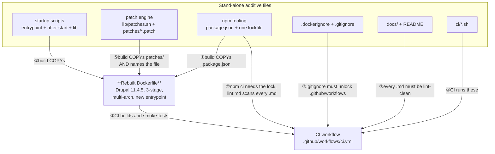
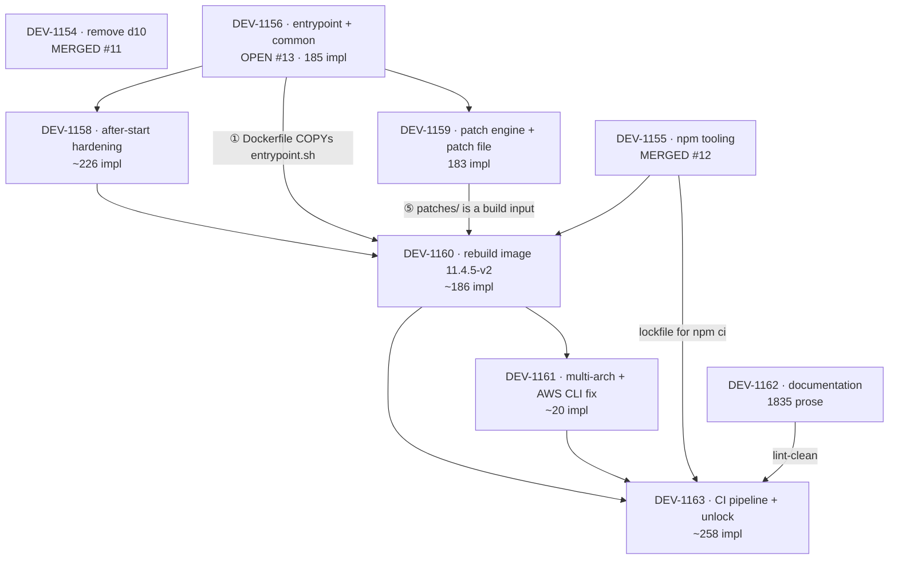

# Seam Review — landing `decom2` on `master` as reviewable pull requests

> **Status: FINAL (rev 3, 2026-08-24).** Target: Drupal 11.4.5 / wrapper `11.4.5-v2`. The premise
> behind most of rev 2's Blockers section is gone: the repo owner confirmed the deployed `dmsm`
> Swarm stack bind-mounts exactly five paths per site, and only `modules/custom` — never the whole
> `modules` directory. `web/modules/contrib`, `web/core`, and `vendor` always come from the image
> and cannot drift. The runtime module-repair seam existed to defend against a volume mask that is
> structurally impossible; it has been deleted, not fixed. See
> [ADR 0005](adr/0005-remove-runtime-module-repair.md).
>
> **Baseline:** `master` now includes the merged `DEV-1154` and `DEV-1155` PRs (GitHub #11, #12).
> **Branch:** `decom2` has not been rebased onto that merged baseline — it still forks from the
> pre-merge `master` and carries `14e65ef..a25c43d` (rev 1's blob through the last version bump),
> rev 2's own commit (`a77bc08`), and **six further commits** made since rev 2
> (`cf5791b..47f8cad`). Full range from the fork point (`ee61e1a..47f8cad`): 32 files,
> +5430 / -143.
>
> **Read this first:** three of rev 2's four blockers are gone by deletion, not by fix — see
> [Blockers](#blockers-fix-or-consciously-accept). Only **B3** (arm64 cannot build) survives, and
> the CI wall (docs not lint-clean) is cleared. What remains is real: the plan's seams now have
> real Jira tickets and, for two of them, real merged GitHub PRs; one open PR is dead and needs a
> human to close it; B3 and a handful of majors are still live. See
> [What changed since rev 2](#what-changed-since-rev-2) and
> [What's still open](#whats-still-open).

---

## What changed since rev 2

| Rev 2 said | Reality today |
| --- | --- |
| The re-land is blocked on four correctness defects and one CI wall | Three of the four blockers are gone — deleted, not fixed. Only B3 (arm64) survives. The CI wall is cleared: `npx markdownlint-cli2` reports 0 errors repo-wide |
| The module-repair PR (486 impl LOC) is the riskiest and largest single PR in the plan | The premise underneath it was false. The deployed `dmsm` stack bind-mounts only `modules/custom`, never the whole `modules` tree — `web/modules/contrib` cannot drift. `repair_composer_managed_modules()` is deleted whole (`cf5791b`); see [ADR 0005](adr/0005-remove-runtime-module-repair.md) |
| M4 (world-readable `settings.php`) and M8 (blind `sleep 60`) are unresolved majors | Both fixed on `decom2`: M4 by `8992ba1`, M8 by `dc8030d` |
| The plan is nine PRs, numbered 1–9, with no link to a tracker | Ten Jira tickets exist under epic DEV-1153, nine of which remain in the plan. Two are already merged as real GitHub PRs (#11, #12); one (`DEV-1157`, the dropped module-repair PR #14) is superseded and needs a human to close it |
| Remaining seams would be cut from `14e65ef..a25c43d` | `decom2` HEAD now carries six further commits with real fixes (permission hardening, the readiness poll, the docs resync) that were never in that original range. Remaining seams must be cut from `decom2` HEAD, not the original blob |
| The docs PR is estimated at 1818 lines | Measured today at 1835 markdown lines plus a 32-line SVG (`README.md` + `docs/**`, excluding this file) — the content changed since rev 2 estimated it, and the docs are already written on `decom2` |

### The commits, by reviewable weight

The LOC distribution is the single most important fact for choosing a strategy:

| Commit | Subject | Total | Non-doc, non-lockfile |
| --- | --- | --- | --- |
| `14e65ef` | `nodecomp` | +3986 / -139 | **+1114 / -138** |
| `f05a8db` | 11.4.1 + robots.txt fix (swaps lockfile to yarn) | +775 / -904 | +18 / -9 |
| `557a32a` | 11.4.2 + patch machinery | +140 / -23 | +132 / -19 |
| `e3a3f81` | 11.4.3 + permission-gating patch | +53 / -40 | +53 / -40 |
| `2ecdaf7` | 11.4.4 | +4 / -4 | +4 / -4 |
| `aef57f0` | 11.4.5 + multi-platform | +19 / -12 | +15 / -10 |
| `a25c43d` | 11.4.5-v1 + contrib bumps (re-adds npm lockfile) | +1292 / -83 | **+4 / -4** |

Commit 1 is the whole problem this document exists to solve. Commits 2-7 are already
PR-sized — but three of them are trivial (`2ecdaf7` is four lines) and the docs drifted **inside**
the bump chain, so replaying them verbatim would ship stale documentation.

### The six commits since rev 2

All tagged `(DEV-1153)`, all local to `decom2` (not yet pushed to `origin/decom2` as of this
writing):

| Commit | Subject | Total |
| --- | --- | --- |
| `cf5791b` | remove runtime module repair and dead integrity hashes | +8 / -238 |
| `eb9d8ac` | stop drupal-scaffold from writing robots.txt | +18 / -2 |
| `8992ba1` | stop after-start leaving settings.php world-readable | +14 / -3 |
| `dc8030d` | replace the blind sleep 60 startup with a readiness poll | +162 / -30 |
| `95a9895` | bump wrapper to 11.4.5-v2 | +4 / -4 |
| `47f8cad` | correct the mount contract across the docs set | +440 / -394 |

Net across all six against rev 2's `a77bc08`: 17 files changed, +643 / -668.

---

## Blockers (fix, or consciously accept)

Three of rev 2's four blockers are gone. Not fixed — deleted, along with the function that caused
them.

### Resolved by the re-land (deletion, not repair)

| Blocker | Rev 2 finding | What happened |
| --- | --- | --- |
| B1 | Self-triggering destroy-and-reinstall loop: the ownership heuristic and the hardening step disagreed, so every restart past the completion marker `rm -rf`'d all ~38 contrib modules and reinstalled them | `repair_composer_managed_modules()` deleted whole (`cf5791b`). There is no ownership heuristic left to disagree with itself |
| B2 | Destructive delete preceded a failure-tolerant restore, with the install's failure swallowed | Same deletion. No runtime `rm -rf` over contrib and no runtime `composer install` exist anywhere in the image |
| B4 | Per-module SHA256 hashes were mis-generated (a `find` operator-precedence bug) and never verified by anything at runtime | The `.<module>.hash` generation deleted (`cf5791b`). Nothing ever read them; a correctly parenthesised `find` would still have produced files with no consumer |

None of these were fixed the way the correctness critic recommended — comparing against
post-hardening ownership, restoring to a temp dir and swapping on success, or adding real startup
verification. Those fixes would have hardened a feature that no longer has a reason to exist: the
repair step existed to re-sync a volume-masked module tree, and that tree is not part of the
deployed mount contract. See [ADR 0005](adr/0005-remove-runtime-module-repair.md).

### B3 — arm64 builds cannot succeed, so the multi-platform claim is false

`aef57f0` added `ARG TARGETARCH` and per-arch apt cache ids precisely so multi-arch builds do not
race on one apt lock (`Dockerfile:8,18,33,83,88,158`). But `Dockerfile:26` still hardcodes
`awscli-exe-linux-x86_64.zip`, and `./aws/install` then executes a bundled x86_64 binary — a
`linux/arm64` build dies with an exec-format error.

**Fix:** select the archive from `$TARGETARCH` (`amd64` to `x86_64`, `arm64` to `aarch64`). While
there, pin the AWS CLI version and verify its signature — today this is an unauthenticated `curl`
piped into a root-privileged install in every image. Or: decide arm64 is not actually needed and
delete the `TARGETARCH` scaffolding instead of fixing it. See [What's still open](#whats-still-open).

### The CI wall — cleared

Rev 2 found 136 markdownlint errors across 5 tracked files; by the time rev 2 measured it the real
number was 85 (two files had already been cleaned). `47f8cad` fixed the rest. Verified today:

```text
$ npx markdownlint-cli2 docs/seam-review.md
Summary: 0 issues in 0 files
$ npx markdownlint-cli2 "**/*.md" "#node_modules" "#graphify-out"
Linting: 13 files
Summary: 0 issues in 0 files
```

### Majors worth naming in a PR body

| # | Where | Finding | Status |
| --- | --- | --- | --- |
| M1 | `Dockerfile:125` | `drupal/jsonapi_extras:3.x-dev@dev` floats, in an image whose stated value is reproducible pinning; no `composer.lock` is tracked. The pinned `3.27` sits commented at `Dockerfile:153` | Live |
| M2 | `Dockerfile:55-61,77` | The guzzle/psr7 advisory suppression still justifies itself by "the fix shipped in 11.3.12" while the base is 11.4.5. Nobody has re-tested whether it is still needed | Live |
| ~~M3~~ | ~~`Dockerfile:156`~~ | ~~`unzip` is purged, but `after-start.sh` runs `composer install` at runtime~~ | **Evaporated** — no runtime `composer install` exists anywhere (`cf5791b`). `unzip` is still purged after the build-time install finishes; nothing at runtime needs it |
| M4 | `after-start.sh:150-154` | ~~`chmod -R 755` over `web/sites` left `settings.php` world-readable~~ | **Fixed**, `8992ba1` — `settings*.php` / `services*.yml` are now `440 root:www-data` |
| M5 | `.github/workflows/ci.yml:50` | Plain `docker build`, no buildx, no `--platform`. CI would never catch B3 | Live |
| M6 | `package.json:18`, `ci/lint.sh:11` | Dual lockfiles with contradictory tooling: `yarn.lock` and `package-lock.json` both tracked, `packageManager: yarn@1.22.22` declared, CI runs `npm ci`. Untouched by the re-land — has no Jira ticket assigned | Live |
| M7 | `ci/smoke-test.sh:15` | The smoke test sleeps 12s and checks PHP/Drush/module directories. It never touches `after-start.sh`, the readiness poll, or `patches.sh` | Live, but easier now — see below |
| M8 | `entrypoint.sh:66-106` | ~~Blind `sleep 60`, exit code discarded~~ | **Fixed**, `dc8030d` — replaced with a readiness poll (`wait_for_http_ready`) with a captured exit status |
| M9 | `scripts/lib/patches.sh:70-96` | The `patch(1)` fallback applies hunk-by-hunk, so a mid-way failure leaves a partial apply that the `--fuzz=3` retry can double-apply. `git` is kept in the image (`Dockerfile:156` comment), so this path is dead code carrying live risk | Live |
| ~~M10~~ | ~~`after-start.sh:174-182`~~ | ~~A hand-placed module in `web/modules/contrib` was `rm -rf`'d and never restored~~ | **Resolved by deletion** — same function as B1/B2 |

**M7 reworded.** There is no repair to re-run, so rev 2's framing ("catch B1/B2/M4 by exercising
the repair path") no longer applies. What the smoke test should now assert is simpler: that
`after-start.sh` runs and completes, that `settings.php` ends up at `440`, and that no patch
marker is left half-applied. The entrypoint's `DRUPAL_AFTER_START_READY_TIMEOUT` and
`DRUPAL_AFTER_START_READY_URL` overrides (`entrypoint.sh:39-41`, added in `dc8030d`) mean CI can
drive that work immediately instead of guessing a fixed delay — a side effect that makes M7
easier to fix, not harder.

---

## The glue holding the pile together

Five kinds of coupling, up from four in rev 1. The new one is ⑤.



1. **① Build-time glue.** The Dockerfile copies `package.json` and the scripts into the image
   (`Dockerfile:189,192-193`), so it cannot build until those exist.
2. **② CI-time glue.** Turning CI on needs four things at once: a Dockerfile that builds, the
   npm tooling plus its lockfile, the `ci/*.sh` scripts, and **every tracked `.md` lint-clean**
   (`build-test` has `needs: lint`).
3. **③ VCS glue.** `master` git-ignores `.github` wholesale; the branch changes this to
   `.github/*` plus `!.github/workflows/`. Until that lands, `ci.yml` cannot even be tracked, so
   the unlock must travel **with** the CI PR. This part of the split has already held in practice:
   `DEV-1155`'s merged `.gitignore` diff carries only scratch-tooling ignores
   (`.vscode`, `graphify-out`, `docs/.temp`, `backlog.jsonl`); the workflow unlock is not in it.
4. **④ Content glue (bidirectional).** `ci/smoke-test.sh:24,26` asserts
   `web/modules/contrib/{jsonapi_extras,search_api}` exist, hard-coding names from the
   Dockerfile's module list. One side of that weld floats (M1).
5. **⑤ Patch glue, and it is atomic.** `Dockerfile:51` copies `./patches/` in the **first**
   build stage and `Dockerfile:67` names
   `patches/auto_node_translate--2026-07-15--3609236--gate-on-permission.patch` literally. If that
   file is absent, the build fails. Separately, `entrypoint.sh:28-31,115-117` sources the patch
   engine and applies discovered patches **synchronously, before Apache starts**, so `patches.sh`
   is a runtime behaviour change rather than inert scaffolding.

**The takeaway is unchanged but sharper:** the Dockerfile is the hinge, CI is the most-coupled PR,
and the patch engine is a second thing that must land before the image can build.

---

## Inventory

| Jira | GitHub PR | Status | Logical change | Files | Kind | Stands alone? |
| --- | --- | --- | --- | --- | --- | --- |
| DEV-1154 | #11 | **Merged** | Decommission the Drupal 10 image | delete `d10/Dockerfile` | move-only | Yes |
| DEV-1155 | #12 | **Merged** | npm tooling, lint config, and ignore rules (minus the workflow unlock) | `package.json`, `package-lock.json`, `.markdownlint.json`, `.dockerignore`, `.gitignore` (scratch entries) | config | Yes |
| DEV-1156 | #13 | Open (Jira: Peer Review) | Two-phase startup entrypoint and shared helpers | `scripts/entrypoint.sh`, `scripts/lib/common.sh` | adds-new | Yes |
| DEV-1157 | #14 | Open, **dropped** | ~~After-start module repair~~ — feature deleted, PR superseded, needs a human to close it | `scripts/after-start.sh` (old version) | — | — |
| DEV-1158 | none yet | Jira: To Do | After-start permission hardening and cleanup | `scripts/after-start.sh` | adds-new | Yes, once DEV-1156 is merged |
| DEV-1159 | none yet | Jira: To Do | Runtime patch engine and the `auto_node_translate` patch | `scripts/lib/patches.sh`, `patches/*.patch`, `patches/.gitkeep` | adds-new | Yes as files; becomes a build input once wired into the Dockerfile |
| DEV-1160 | none yet | Jira: To Do | Rebuild the image on a three-stage build | `Dockerfile` (1-stage to 3-stage, 41 pinned packages, GD/AVIF, AWS CLI, manifest, prod php.ini, entrypoint wiring) | switches-it-on | No — needs DEV-1155, DEV-1156, DEV-1158, DEV-1159; carries M1, M2 |
| DEV-1161 | none yet | Jira: To Do | Multi-platform build support and the x86-pinned AWS CLI | `Dockerfile` `TARGETARCH` args and per-arch apt caches | adds-new | Yes on top of DEV-1160, but **broken** until B3 is fixed |
| DEV-1162 | none yet | Jira: To Do | Documentation set | `README.md`, `docs/CONTEXT*.md`, `docs/prd.md`, `docs/architecture*.md`, `docs/drupal-docker-wrapper.md`, `docs/adr/000{1..5}*.md`, `docs/images/overview.svg` | docs | Yes, and already written on `decom2` (`47f8cad`) — only needs opening as a PR |
| DEV-1163 | none yet | Jira: To Do | CI pipeline with the workflow gitignore unlock | `.github/workflows/ci.yml`, `ci/{lint,smoke-test,test-ci-locally}.sh`, the remaining `.gitignore` hunk | adds-new | Only last — see glue ② and ③ |

`DEV-1157`'s ticket cannot move to Done while its PR stays open — this Jira project's workflow has
only To Do / In Progress / Code Review / Done, with no Won't Do or Cancelled state, so it sits in
Peer Review pending a human closing PR #14. Every ticket from `DEV-1158` onward carries a dated
"Amendment 2026-08-24 (DEV-1153 re-land)" note that the old "PR n/10" numbering in its description
is off by one now that the module-repair PR is dropped — this document is the authoritative
re-cut. `DEV-1160` and `DEV-1162`'s Jira summaries still say `11.4.5-v1` and need a human rename.

> ⚠️ **Two risks must still be named in their PR body, never dark-shipped:**
>
> - `Dockerfile:55-61,77` suppresses three guzzle/psr7 security advisories per BL-695, on a
>   rationale that predates the current base image (M2).
> - `scripts/entrypoint.sh:28-31,115-117` applies **any** discovered `.patch` file to the contrib
>   tree at every container start, synchronously, before Apache.
>
> One risk from rev 2 is gone: `scripts/after-start.sh:211` and `:257` no longer exist.
> `repair_composer_managed_modules()` — the only runtime `rm -rf` over contrib and the only
> runtime `composer install` — was deleted whole (`cf5791b`). The one `rm -rf` left in
> `after-start.sh` (line 49) removes a single deprecated file, not a directory tree.

---

## Pre-cut fix-ups

Defects in the pile that any plan inherits. Two of the five are done; three remain.

**P1 — Make the tracked markdown lint-clean. DONE.** `47f8cad` cleared the last of the errors; see
[The CI wall — cleared](#the-ci-wall--cleared).

**P2 — Resolve the package-manager contradiction.** Still open. `package-lock.json` and
`yarn.lock` are both committed; `package.json:18` declares `packageManager: yarn@1.22.22`; CI
runs `npm ci`. Unchanged since rev 2 — `DEV-1155` merged the rest of the npm tooling without
touching this (M6). *Recommended:* delete `yarn.lock` and the `packageManager` field, keep npm.

**P3 — Re-test the BL-695 advisory suppression at 11.4.5.** Still open. Build once with
`policy.advisories.ignore-id` (`Dockerfile:77`) removed. If it builds clean, delete the block and
the ⚠️ disappears from the plan entirely. If it does not, correct the stale 11.3.12 rationale at
`Dockerfile:55-61` and give it an expiry date.

**P4 — Resync the docs to the current wrapper version. DONE.** `47f8cad` resynced the whole docs
set to Drupal 11.4.5 / wrapper `11.4.5-v2`. The two remaining "11.4.1" mentions
(`docs/prd.md:143`, `docs/architectural-plan.md:463`) are correct historical references to when
the CVE fix shipped, not drift — verified by reading both in context.

**P5 — Decide this document's fate.** Still open, and more clearly moot than in rev 2: this is
rev 3, and the re-land still is not finished. *Recommended, unchanged:* keep it until the re-land
completes, then delete it in the final PR.

**Dropped from rev 1 (unchanged):** the README `11.3.11` version typo — already fixed, zero
matches remain.

---

## The plan

Rev 1's three options are retired. Here is why, and what replaces them.

**Why A and B collapsed into each other.** B's only claimed edge was "the Dockerfile flip has zero
prerequisite-merge coupling." But A already orders its additive PRs before the image, so by the
time the image is reviewed its inputs are on `master` in both — identical state, different
paragraph. What remained was a bundling knob, not a theory of seaming. That is exactly the test
rev 1 applied to kill the first draft of Option C.

**Why C is dead.** C existed to ship the Critical `SA-CORE-2026-005..009` core fix ahead of the
risky runtime review. That fix shipped in 11.3.12 and `Dockerfile:4` is now 11.4.5. Its
load-bearing claim — "C4 needs no scripts or `package.json`" — is also false now that
`Dockerfile:51` copies `patches/` in the first build stage.

**Why not simply stack the existing 7 commits.** Tempting, and it would preserve the ticket-tagged
history — but PR #1 would still be the 4000-line `nodecomp` blob, which is the entire problem.
Conversely, a full reset-and-re-cut throws away five well-scoped commits for nothing.

**The plan is a hybrid:** re-cut **only** `14e65ef` into seams, and fold the six later commits into
the PRs where their content belongs. One PR per Drupal version bump is explicitly rejected —
`2ecdaf7` is a four-line change and `a25c43d` is four non-lockfile lines, so per-version PRs are
pure review overhead, and replaying them verbatim would preserve the doc drift P4 exists to fix.

### Sizing and dependencies

LOC counts are measured directly against `decom2` HEAD (`wc -l`, `git diff --stat`, or a merged
PR's own `additions`/`deletions`) except where marked (est.). **Impl** is implementation code
against the ~200 target / 400 ceiling; **Other** is lockfiles, prose, and patch data, which do not
count against it.

The 400-line ceiling that forced rev 2's `4a`/`4b`/`4c` split no longer binds. `4b` — the
destructive `rm -rf`/`composer install` path — is gone. What is left splits naturally into
`DEV-1156` (185 impl) and `DEV-1158` (~226 impl), both comfortably under the ceiling without
three-way surgery.

| Jira | One sentence | Kind | Impl LOC | Other LOC | Depends on |
| --- | --- | --- | --- | --- | --- |
| DEV-1154 | Remove the retired Drupal 10 image | move-only | -63 (all deletions) | — | — *(merged)* |
| DEV-1155 | Add npm tooling, lint config, and ignore rules on one package manager | config | 73 | 1195 lockfile | — *(merged)* |
| DEV-1156 | Add the two-phase startup entrypoint and shared shell helpers | adds-new | 185 | — | — *(open, #13)* |
| DEV-1158 | Add after-start permission hardening and cleanup | adds-new | ~226 (est. — whole file; not yet cut as its own diff) | — | DEV-1156 |
| DEV-1159 | Add the runtime patch engine and the `auto_node_translate` patch | adds-new | 183, less the `patch(1)` fallback this PR deletes per M9 | 49 patch | DEV-1156 |
| DEV-1160 | Rebuild the image on a three-stage build | switches-it-on | ~186 (est. — 206 measured Dockerfile delta minus ~20 attributable to DEV-1161) | — | DEV-1155, DEV-1156, DEV-1158, DEV-1159 |
| DEV-1161 | Enable multi-platform builds and fix the x86-pinned AWS CLI | adds-new | ~20 (est., unchanged since rev 2 — none of the six new commits touched `TARGETARCH`) | — | DEV-1160 |
| DEV-1162 | Land the documentation set | docs | — | 1835 markdown + 32 SVG (measured; already written) | — |
| DEV-1163 | Add the CI pipeline with the workflow gitignore unlock | adds-new | ~258 (measured: 99+62+29+68 across `ci.yml` + 3 scripts) plus a small `.gitignore` hunk | — | DEV-1160, DEV-1161, DEV-1162, DEV-1155 (lockfile) |

`DEV-1157` (the dropped module-repair PR, 486 impl LOC) is excluded from this table — it will
never land.

**DEV-1162 at 1835 lines is enormous but is entirely prose**, so the ceiling does not apply. Its
content already exists on `decom2`; what remains is opening it as a real PR.

**DEV-1163 at ~258** is coherent and is the one PR that cannot be split: the workflow, its
scripts, and the `.gitignore` unlock must land atomically (glue ③).



**Recommended order:** `DEV-1154`/`DEV-1155` are already merged. Next: `DEV-1156` (already open)
merges, then `DEV-1158` and `DEV-1159` in parallel, then `DEV-1160`, `DEV-1161`, `DEV-1162`
(content already written, just needs opening), `DEV-1163` last.

### Where each finding lands

| Finding | Lands in | Disposition |
| --- | --- | --- |
| B1, B2, B4, M10 | — | Resolved by deletion in `cf5791b`, already on `decom2` |
| M4 | — | Fixed in `8992ba1`, already on `decom2` |
| M8 | — | Fixed in `dc8030d`, already on `decom2` |
| M9 | DEV-1159 | Delete the `patch(1)` fallback — `git` is kept in the image, so it is dead code |
| M1, M2 | DEV-1160 | Disclose in the body; M2 may vanish if Fork F1 below resolves clean |
| B3 | DEV-1161 | Fix is the point of the PR, or delete the scaffolding — see [What's still open](#whats-still-open) |
| M5, M7 | DEV-1163 | Add buildx; strengthen the smoke test per the M7 reword above |
| M6 | unclaimed | Still needs a home — `DEV-1155` merged the rest of the npm tooling without touching it |

---

## War-game of the re-land

The plan above is the blue-sky path. This section fights it move by move — depth 2, executor tier
T2–T3 (a trigger-following model). Per move: the action, the observation that means it worked, the
most likely failure with its signals, and the pre-decided countermove.

### Recon (before the next move)

- Confirm the lint baseline: `npx markdownlint-cli2 $(git ls-files '*.md')` — 0 today, not 136 or
  85.
- Confirm `decom2`'s relationship to the real `master`: `git merge-base --is-ancestor master
  decom2` is only true against the **old** `master` (`ee61e1a`). The real `master` has since moved
  (merged `DEV-1154`, `DEV-1155`), and `decom2` has not been rebased onto it.
- Confirm both lockfiles still exist and agree: `yarn.lock` and `package-lock.json` are both still
  tracked (M6). `yarn.lock` is untouched since rev 2; `package-lock.json` had its two version
  fields bumped by `95a9895`, so do not expect a zero diff there.
- Confirm a local Docker build of `decom2` HEAD succeeds on amd64 before cutting anything further.

### Moves already executed for real

`DEV-1154` and `DEV-1155` are merged (`#11`, `#12`). Both landed the way rev 2's war-game
predicted: PR1 had no plausible failure and none occurred; PR3's `.gitignore` hunk was split
deliberately, exactly as its countermove demanded — `#12`'s merged diff carries only the
scratch-tooling ignores (`.vscode`, `graphify-out`, `docs/.temp`, `backlog.jsonl`); the
`.github/workflows` unlock is not in it and still lives only on `decom2`, where it belongs until
the CI PR. The lint-clean prep (rev 2's "PR 2") never became its own ticket — it shipped inside the
documentation commit (`47f8cad`) instead, and nothing depended on it separately.

### Move — DEV-1156 + DEV-1158 (was "the highest-risk move" in rev 2)

Rev 2 called this move the highest risk in the whole plan: it had to fix a self-triggering restart
loop, a delete-before-restore ordering bug, world-readable `settings.php`, and a discarded
`sleep 60` exit code, all in the one PR that runs at container start. Two of those findings are not
fixed, they are gone — B1 and B2 do not exist once `repair_composer_managed_modules()` is deleted.
What is left to land is much smaller:

- **DEV-1156** (open, `#13`): `entrypoint.sh` + `lib/common.sh` — already a real PR (148 + 37
  lines). `lib/common.sh` is identical to `decom2` HEAD, but `entrypoint.sh` is **not**: `#13` still
  carries the old comment justifying the patch step by "a volume-mounted contrib tree (which shadows
  the image's build-time composer-patches)", which `dc8030d` corrected on `decom2` to the
  bind-mounted `modules/custom` tree. Fold that one comment hunk into `#13` before merging it, or
  the branch ships wording this whole re-cut exists to remove.
- **DEV-1158** (not yet opened): `after-start.sh` — deprecated-path cleanup, permission hardening
  (the M4 fix), and cache rebuild. No delete, no install, no loop.

- **Expect:** both land inert; nothing copies them into an image yet (that is `DEV-1160`'s job).
- **Likely failure:** a sequencing bug, not a destructive one. `after-start.sh` calls
  `read_wrapper_version()`, which is defined in `lib/common.sh` — a function `DEV-1156`
  introduces. If `DEV-1158` is branched off `master` before `DEV-1156` merges, it is missing a
  function its own startup path depends on.
- **Countermove:** branch `DEV-1158` off `DEV-1156`'s branch, not off `master`, until `DEV-1156`
  merges.
- **Why the risk profile actually dropped:** the two things that made this "the highest-risk move"
  were a live restart-triggered `rm -rf` over ~38 module directories and a swallowed install
  failure. Neither exists any more. What remains is a chmod-ordering script with a proven
  precedent — `8992ba1` already landed the same content on `decom2` — and no delete of anything
  with real content in it. The one `rm -rf` left in `after-start.sh` (line 49) removes a single
  deprecated file, not a directory tree.

### Fork F1 — Does the advisory suppression survive P3?

- **Trigger:** build once at 11.4.5 with `policy.advisories.ignore-id` removed.
  - **Clean build** to Route A: delete the block; `DEV-1160` loses one ⚠️ and one disclosure.
  - **Build fails on advisories** to Route B: keep the block, rewrite the rationale comment to
    cite 11.4.5 and the live upstream issue, add an expiry date, and disclose it in `DEV-1160`.

### Move — DEV-1159 (patch engine)

- **Action:** land `lib/patches.sh` (with the `patch(1)` fallback deleted per M9) and the patch
  file.
- **Expect:** files on `master`; `entrypoint.sh` already sources them but no image ships yet.
- **Likely failure:** the patch is validated only by "it applies", not by "it applies to the
  version we pin". `auto_node_translate:3.0.2` is pinned at `Dockerfile:108`; a patch cut against
  a different revision may apply with fuzz and silently corrupt the module.
- **Countermove:** validate with a strict `git apply --check` against an unpacked 3.0.2, and fail
  the build rather than fuzz. Record the validated module version in the PR body.

### Move — DEV-1160 (rebuild the image)

- **Action:** land the 3-stage Dockerfile at 11.4.5-v2.
- **Expect:** `docker build .` succeeds on amd64; the container serves HTTP 200; the contrib tree
  contains the pinned package set.
- **Likely failure:** the build succeeds locally from cache but fails clean. Cause:
  `jsonapi_extras:3.x-dev@dev` resolves to a different commit than the cached one (M1). Signals: a
  `composer require` conflict that did not occur yesterday, or a smoke test that passes locally
  and fails in CI.
- **Countermove:** pin `jsonapi_extras` in this PR. If it genuinely must float, say so explicitly
  in the PR body next to the guzzle disclosure.
- **Second-order:** this is the first PR where `master` ships a runtime that runs
  `after-start.sh` against a live, bind-mounted `web/sites`. The chmod pass is idempotent and
  touches no contrib code — nothing here is destructive — but it is still the first time this
  logic meets a real multisite tree. Do not merge on a Friday.

### Move — DEV-1161 (multi-arch)

- **Action:** parameterise the AWS CLI archive by `$TARGETARCH` and confirm both arches build, or
  delete the `TARGETARCH` scaffolding if nobody can name a deployment target — see
  [What's still open](#whats-still-open).
- **Expect (fix route):** `docker buildx build --platform linux/amd64,linux/arm64 .` succeeds.
- **Likely failure:** arm64 fails somewhere *else* than the AWS CLI — the GD rebuild or a contrib
  module with a native dependency. Cause: nobody has ever built this arm64. Signals: a compile
  error in the `docker-php-ext-install gd` layer.
- **Countermove:** this PR's scope is "make the multi-arch claim true **or** withdraw it." A false
  capability claim is worse than no claim.

### Move — DEV-1162 (documentation)

This move already happened for real, not as a future action. `47f8cad` resynced the docs to
11.4.5-v2 on `decom2`. Verified: `npx markdownlint-cli2` reports 0 errors, and
`grep -rn --exclude=seam-review.md "11\.4\.[0-4]" docs/ README.md` returns exactly two hits, both
correct historical references to the 11.4.1 CVE fix (`docs/prd.md:143`,
`docs/architectural-plan.md:463`), not drift. The exclusion matters: this file's own commit-weight
table legitimately cites those older versions, so an unfiltered grep returns eight hits and reads
like drift when it is not.
What remains is opening `DEV-1162` as a real PR against `master`, not writing the content.

### Move — DEV-1163 (CI, last)

- **Action:** land `ci.yml` **with** the `!.github/workflows/` unlock in the same commit, plus
  buildx (M5) and the strengthened smoke test (M7).
- **Expect:** the first CI run on the PR itself goes green — lint, then build, then smoke.
- **Likely failure:** the workflow file cannot be committed at all. Cause: `.gitignore` on
  `master` still excludes it (glue ③) and `git add` silently no-ops. Signals: `git status` shows
  nothing after adding the file.
- **Countermove:** stage the `.gitignore` change **first** in the same branch, then add the
  workflow. Verify with `git check-ignore -v .github/workflows/ci.yml` returning nothing before
  committing.
- **Second-order:** the strengthened smoke test is the first thing that has ever exercised
  `after-start.sh`. Expect it to surface at least one defect the reworked M7 did not anticipate.
  Budget for that rather than treating a red first run as a CI misconfiguration.

### Assumptions (flagged, not silently resolved)

- **(VARIABLE: arm64 is actually wanted.)** The plan assumes multi-arch is a real requirement. If
  nothing consumes an arm64 image, `DEV-1161` should delete the `TARGETARCH` work instead of
  fixing it.
- **(VARIABLE: whether a live advisory affects 11.4.5.)** Fork F1 resolves this empirically, but
  if one exists, `DEV-1160` may need to jump the queue.
- **Assumed and acted on:** that the two lockfiles agreeing today makes P2 a safe delete. Verified
  for the three declared devDependencies; not verified transitively. This has held across the
  whole re-land so far without incident, and is still unresolved as a live item (M6).

### Abort conditions

Stop and escalate rather than improvising if any of these occur:

- `decom2` HEAD does not build on amd64 during recon — the whole plan rests on a buildable branch.
- Two consecutive CI runs fail in `DEV-1163` for reasons not covered by a countermove above.
- Any move requires force-pushing, closing, or deleting an already-open PR in this chain.
  `DEV-1157` / `#14` needs a human to close it — that is a deliberate exception this document
  flags, not something to do unprompted.
- A future `dmsm` stack-template change reintroduces a whole-`modules` bind mount before this is
  caught — stop and reopen the module-repair question rather than silently re-adding a runtime
  repair step here. This is ADR 0005's own recorded consequence.

### Verification (what "done" means)

- `DEV-1156` through `DEV-1163` merged (`DEV-1154`, `DEV-1155` already are); `git diff
  master...decom2` empty apart from this document once `decom2` is rebased onto the merged
  baseline.
- No runtime `composer install` or `composer require` exists anywhere in `scripts/`:
  `grep -rn "composer install\|composer require" scripts/` returns nothing (verified today).
- `web/robots.txt` is absent from a freshly built image:
  `docker run --rm <image> test -f /opt/drupal/web/robots.txt` exits nonzero.
- `settings.php` is not world-readable: `stat -c '%a' web/sites/*/settings.php` reports `440`.
- The completion marker is named for the current wrapper version and lives on the mounted `temp/`
  volume, falling back to `/tmp` when no volume is mounted: `after-start-<version>.complete`, where
  `<version>` is `package.json`'s `version` field (`11.4.5-v2` today), read via
  `read_wrapper_version()` in `lib/common.sh`. It marks only the `sites/` permission pass as done
  for this version on this volume; image-code hardening and the cache rebuild run on every start.
- `npx markdownlint-cli2 $(git ls-files '*.md')` exits 0 (verified today).
- **B3 is closed one way or the other.** Either
  `docker buildx build --platform linux/amd64,linux/arm64 .` succeeds, or the `TARGETARCH`
  scaffolding is deliberately removed and that decision is recorded. B3 is the only surviving
  blocker, so a checklist that does not mention it can be fully satisfied while the image still
  makes a false multi-platform claim.
- CI green on `master`: lint, build, smoke.
- Exactly one lockfile tracked (M6 — still open, still two today).

---

## What the reviewers said

Three independent critics reviewed the rev 1 document **and** the tree at that time. Every claim
below was re-verified against source before being folded in. This section records what was found;
what actually happened to each finding since is noted separately.

### Seam-critic — verdict: `SET-STALE`, all three options re-cut

- Confirmed the rev 1 premise is dead: 7 commits, not an uncommitted pile.
- **Headline:** the docs are **not** lint-clean — 136 errors across 5 tracked files. Rev 1's own
  reviewer had certified the docs PR as "known to stay green." That certification was
  technically-true-but-irrelevant, and every option's CI ordering rested on it.
- Found that the rev 1 "fix" for dangling hub links had been applied as empty `(#)` anchors,
  which trips MD042 — the fix caused the failure.
- Found glue ⑤: `Dockerfile:51,67` make `patches/` a hard build input, which **destroys Option
  C's load-bearing premise** ("C4 needs no scripts") and Option B's ("the flip has zero
  prerequisite coupling").
- Found the second `rm -rf` at `after-start.sh:257` that rev 1 missed.
- Corrected every stale line reference in rev 1 (the guzzle ignore is `Dockerfile:70`, not `:64`;
  the COPYs are `:51,185,188-189`, not `:47,178,181-182`).

### Correctness and security critic — verdict: **BLOCK**

- **B1**, the restart loop: the repair heuristic and the hardening step disagree about correct
  ownership, and the completion marker lives in `/tmp`. Independently verified here —
  `after-start.sh:66-67` sets the expectation to `33:33`, `:288` leaves `0:33`.
- **B2**, delete-before-restore with a swallowed failure.
- **B3**, arm64 cannot build because of the x86-pinned AWS CLI.
- **B4**, the integrity hashes are both mis-generated and unverified, while the docs claim them.
- Ten majors, of which **M7** (the smoke test never reaches `after-start.sh`) is the one that
  would have caught three of the four blockers on its own.
- Credited `docs/architecture.md:323` for being honest that the hashes are not machine-verified —
  that honesty is what made B4 quick to confirm.

**Disposition (2026-08-24).** B1, B2 and B4 were not fixed using any of the above recommendations
— comparing against post-hardening ownership, a temp-dir-and-swap restore, or real startup
verification. The function all three findings live in, `repair_composer_managed_modules()`, was
deleted outright (`cf5791b`) once the repo owner confirmed the mount contract makes the volume
mask it defended against structurally impossible. See
[ADR 0005](adr/0005-remove-runtime-module-repair.md). B3 remains open exactly as found.

### Devil's advocate on strategy — verdict: both premises wrong, go hybrid

- **Decisive finding:** Options A and B have **converged**. B's only edge is a bundling knob, not
  a rival theory of seaming — the same test that killed the first draft of Option C.
- Option C's reason to exist expired: the tree is five releases past the CVE that motivated it.
- Argued against both pure strategies: a stacked chain leaves the 4000-line `nodecomp` as PR #1;
  a full re-cut discards five well-scoped commits. Hence the hybrid.
- Rejected "one PR per version bump" with evidence: `2ecdaf7` is 4 lines, `a25c43d` is 4
  non-lockfile lines, and the docs drifted inside the chain.
- **Highest-impact objection all of rev 1's reviewers missed:** the dual-lockfile contradiction.
  Every option's CI prerequisite set was stated against a tooling reality that no longer holds.
- Noted that rev 1 of this document was itself committed inside the pile it describes, shipping a
  stale premise to `master` as project documentation.

---

## What's still open

Rev 2's dilemma — fix the four blockers during the re-land, or land the pile as-is and fix forward
— is settled and mostly moot. Three of the four blockers do not exist any more, and the fourth
(B3) already has an obvious fix path written into its own finding. What is genuinely still open is
two separate things, not one.

**Is arm64 actually required?** Nothing in this repository states a consumer for an `arm64`
image. `aef57f0` added the `TARGETARCH` scaffolding and per-arch apt cache ids without recording
who asked for it or where an arm64 image would run. If nobody can name a deployment target,
`DEV-1161` should delete the `TARGETARCH` args and the multi-arch claim rather than spend effort
fixing an unauthenticated x86-pinned `curl | install` for an architecture nothing needs. If a real
target exists, `DEV-1161` fixes B3 as planned. This is the one place in the plan where "ship the
fix" and "ship the deletion" are both live options, and the answer depends on information this
document does not have.

**The contrib pin is now load-bearing on the mount contract alone.** ADR 0005 already records the
consequence: removing the runtime repair step means the version pins in the Dockerfile's
`composer require` block are no longer reinforced by anything that runs after the image is built.
Today that is fine — the mount contract genuinely never bind-mounts over `web/modules/contrib`.
But nothing in this repository can stop a future `dmsm` stack-template change from reintroducing a
whole-`modules` mount. If that ever happens, the pin is silently defeated and there is no code left
here to notice. Enforcing that has to live in the `dmsm` repo, not this one — this document cannot
resolve it, only name it as the thing to watch.
